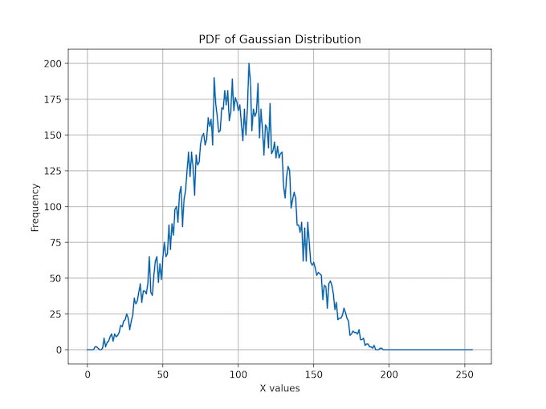
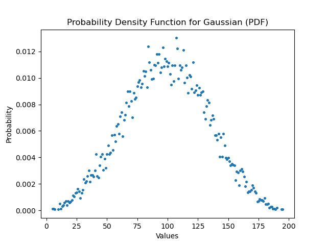
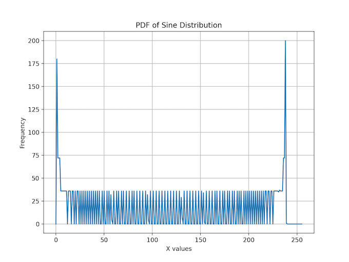
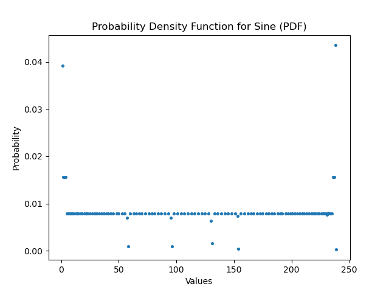
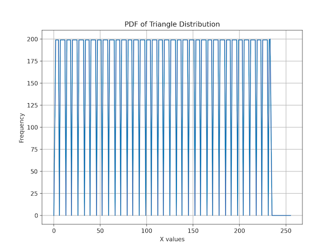
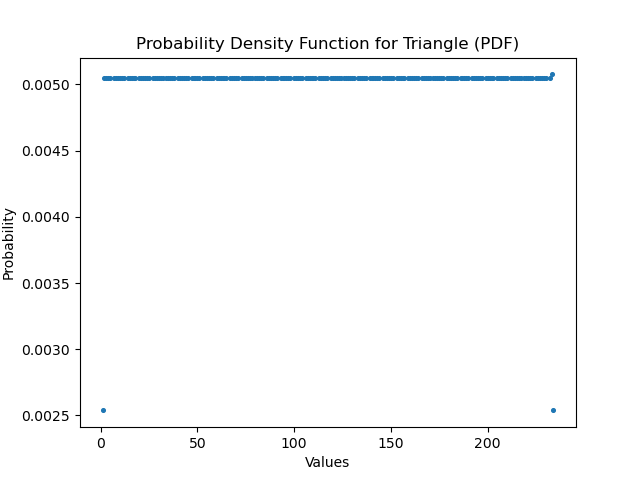
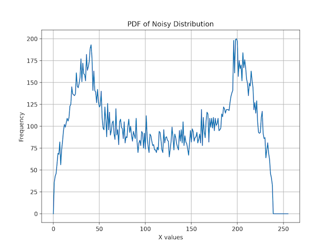
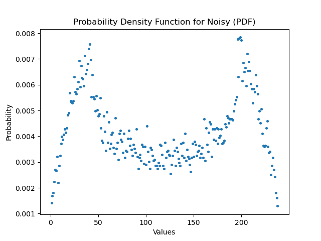

# Team14 - Team Write-Up

## Overview

We were asked to design a RISC-V CPU based on its ISA for our Instruction Architecture and Compilers course (IAC). It was an incredibly rewarding experience with great learning opportunities.

We were able to deliver in the span of three weeks:
- A Single Cycle CPU
- A Pipelined 5-stages CPU
- A 5-stages Pipelined CPU with direct-mapped cache
- A Single Cycle CPU with fully-associative cache

Logic was also derived to implement a 4-way associative cache. System-Verilog draft of the code was submitted along this repository, but remains uncomplete.
One could also check the `Project` directory to verify the individual `.sv` files and their respective testbenches.

## Quick Start

`exe.sh` is a Shell script that loads different instructions and data into the processor.

`exe.sh` takes either zero, one or two arguments. These arguments precise the testbench used for the testing, whether it is the Formula Lights or Reference program:

| Command                           | Outcome                                       |
| --------------------------------- | --------------------------------------------- |   
| `source ./exe.sh f1`              | Run Formula Lights Program                    |
| `source ./exe.sh pdf gaussian`    | Run PDF program for gaussian.mem              |
| `source ./exe.sh pdf triangle`    | Run PDF program for triangle.mem              |
| `source ./exe.sh pdf sine`        | Run PDF program for sine.mem                  |
| `source ./exe.sh pdf noisy`       | Run PDF program for noisy.mem                 |

One should first move into the `RTL` directory before typing in Terminal the commands:

``` Shell
cd RTL
```

The Formula Lights program has both a `RESET` and `TRIGGER`:
- `RESET` can be controlled by toggling Vbuddy's push-button
- `TRIGGER` is controlled via the rotary encoder: any value greater than 50 makes `Trigger` `HIGH`

To restart the counting sequence, one would have to toggle the push-button, then set the rotary encoder to some value greater than 50.

> Our trigger is wired directly to register S3. Please be mindful of this if testing with your own program.


## Proof of Successs

| PDF   	| Output    												| Expected Output   											|
| ----- 	| --------------------------------------------------------- | ------------------------------------------------------------- |
| Gaussian 	| 	|  |
| Sine		| 		| 			|
| Triangle	| 	| 	|
| Noisy		| 	| 		|


Single Cycle CPU:
- [Formula Lights](https://youtu.be/zJto4plLvCE)
- [PDF Gaussian](https://youtu.be/Mq9BEwbvduk)
- [PDF Noisy](https://youtu.be/FlwG2JfLp6k)
- [PDF Sine](https://youtu.be/67-TDc_EGnA)
- [PDF Triangle](https://youtu.be/VC7Lewtsuus)


Pipelined CPU:
- [Formula Lights](https://youtu.be/59yWMzJzut0)
- [PDF Gaussian](https://youtu.be/r62WZPJNDN0)
- [PDF Noisy](https://youtu.be/OM9mQih1nxs)
- [PDF Sine](https://youtu.be/j93-G7-LUJU)
- [PDF Triangle](https://youtu.be/5SQwBv_uGIY)


Cache
- [Formula Lighst](https://youtu.be/0z1GHnXMrG4)


## Specifications

| Property                  | Value             |
| ------------------------- | ------------------|
| Instruction Memory Size   | 2^12 bits         |
| Instruction Width         | 32-bit            |
| Data Memory Size          | 2^17 bit          |
| Data Width                | 8-bit             |
| Data Cache Size           | 256 bits          |
| Data Cache Sets           | 8                 |
| Data Cache Ways           | 1                 |
| Data Cache Block Size     | 4 * 8-bit         |


## Implemented Instructions

| Type  | Implemented Instructions  |
| ----- | ------------------------- |
| `R`   |`ADD`, `SUB`, `SLL`, `SLT`, `SLTU`, `XOR`, `SRL`, `SRA`, `OR`, `AND`|
| `I`   |`ADDI`, `SLLI`, `SLTI`, `XORI`, `SRLI`, `SRAI`, `ORI`, `ANDI`, `LBU`, `LW`, `JALR`|
| `B`   |`BNE`|
| `S`   |`SW`, `SB`|
| `U`   |`LUI`|
| `J`   |`JAL`|


## Task Division

|               |                               | Sara Chehab (sarachehab)  | Utsav Goe (utsav254)  | Lu Ju (luju1108)  | Neil Radhul (Nr722)   |
| ------------  | ----------------------------- | ------------------------- | --------------------- | ----------------- | --------------------- |
| General       | Top Testbenches               |                           |                       | X                 |                       |
|               | Subfile Testbenches           | X                         | X                     | C                 | C                     |
|               | Shell Script                  | X                         |                       |                   |                       |
|               | F1 Assembly                   | X                         | X                     |                   |                       |
| Single Cycle  | Program Counter               | X                         |                       |                   |                       |
|               | Main Decoder                  | X                         | X                     |                   |                       |
|               | Alu Decoder                   |                           |                       |                   | X                     |
|               | Control Unit                  |                           |                       | X                 | X                     |
|               | Register File                 |                           |                       | X                 |                       |
|               | ALU                           | C                         |                       | X                 |                       | 
|               | Data Memory                   | C                         |                       |                   | X                     |
|               | Datapath                      |                           | C                     | X                 |                       |
|               | Sign Extend                   |                           |                       |                   | X                     |
|               | Top File                      | X                         |                       |                   | X                     |
|               | Testing                       | X                         | X                     | X                 | X                     |
| Pipeline      | Pipeline Register             | X                         |                       |                   |                       |
|               | Hazard unit                   |                           |                       | X                 |                       |
|               | Refactoring                   | X                         |                       |                   |                       |
|               | Top File                      | X                         |                       |                   |                       |
|               | Testing                       | X                         |                       | X                 |                       |
| Cache         | Direct Mapped Cache           | C                         | X                     |                   | X                     |
|               | RAM Refactor                  |                           | X                     |                   | X                     |
|               | Data Memory                   |                           | X                     |                   | X                     |
|               | Control Unit Refactor         |                           | X                     |                   | X                     |
|               | Pipelining Refactor           | X                         |                       |                   |                       |
|               | Testing                       | X                         | X                     | X                 | X                     |
|               | Fully Associative Cache       |                           | X                     |                   | X                     |
|               | Testing                       |                           | X                     |                   | X                     |


## Final Structure

```
. 
├── lab4 
├── project 
├── data_memory/ 
│ ├── gaussian.mem 
│ ├── noisy.mem 
│ ├── sine.mem 
│ └── triangle.mem 
├── instruction_memory/ 
│ ├── F1.asm 
│ ├── F1.hex 
│ ├── pdf.hex 
│ └── pdf.s
├── project/ 
│ 	├── pc/ 
│ 	│ ├── doit.sh
│ 	│ ├── pc.sv
│ 	├── pc_tb.cpp 
│ 	├── instruction_memory/
│ 	│ ├── doit.sh
│ 	└── ...
└── RTL/ 
	├── control_unit/ 
	│ ├── main_decoder.sv 
	│ ├── alu_decoder.sv 
	│ └── control_unit_top.sv 
	├── data_path/ 
	│ ├── alu.sv 
	│ ├── datapath.sv 
	│ ├── data_memory.sv 
	│ └── register_file.sv 
	├── extend_unit/ 
	│ └── extend_unit.sv 
	├── instruction_memory/ 
	│ └── instruction_memory.sv 
	├── program_counter/ 
	│ └── pc.sv 
	├── cpu.sv 
	├── data_memory.mem 
	├── instructions.hex 
	├── exe.sh 
	├── f1_tb.cpp 
	├── pdf_tb.cpp 
	├── plot_distribution.py 
	├── vbuddy.cpp 
	└── vbuddy.cfg
```
