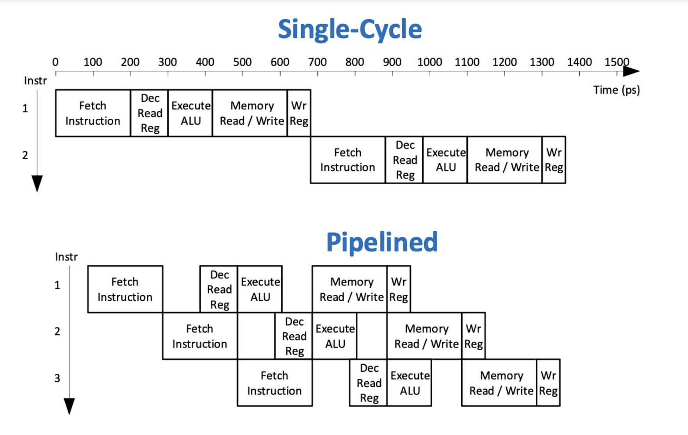
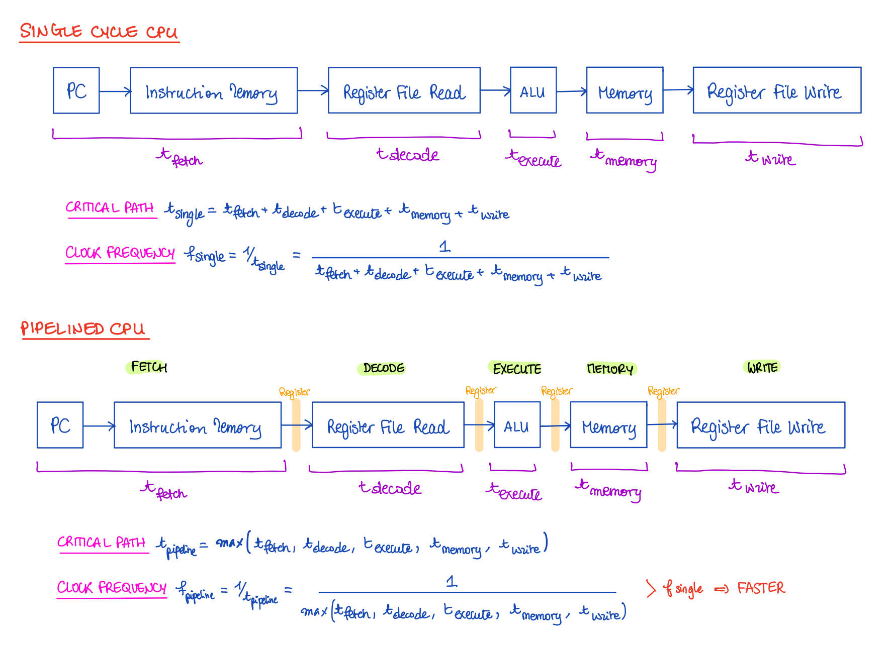
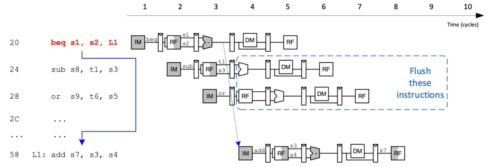
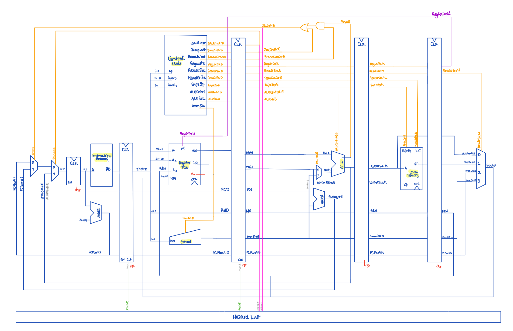
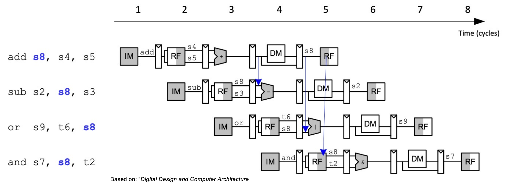
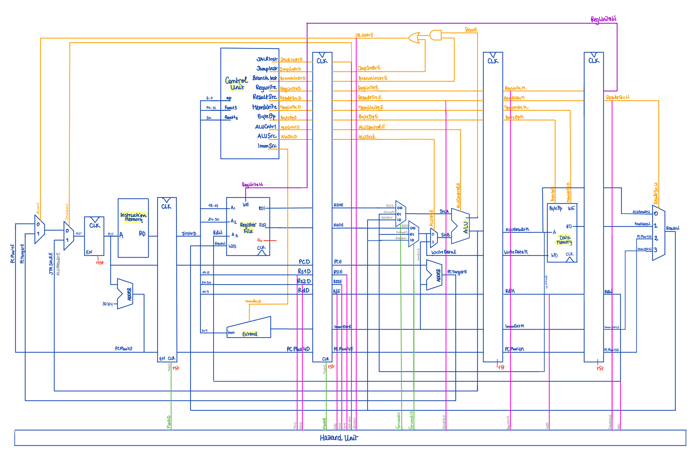
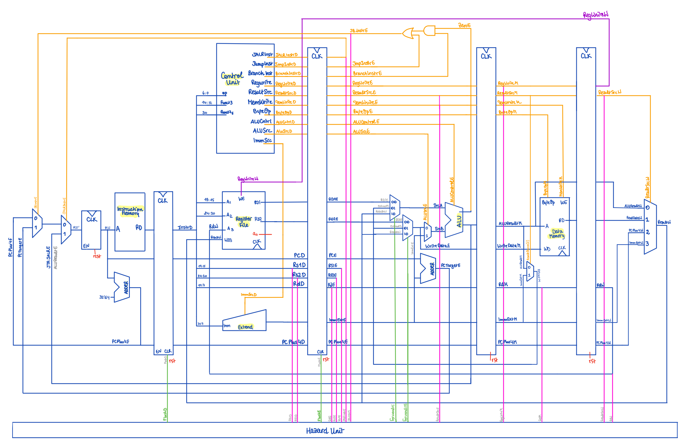
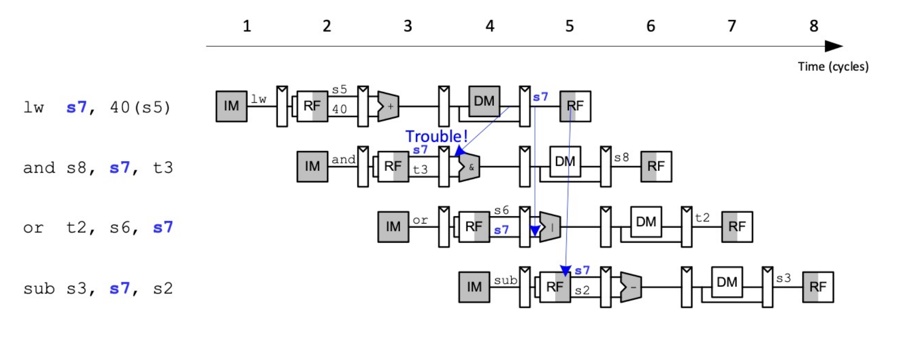
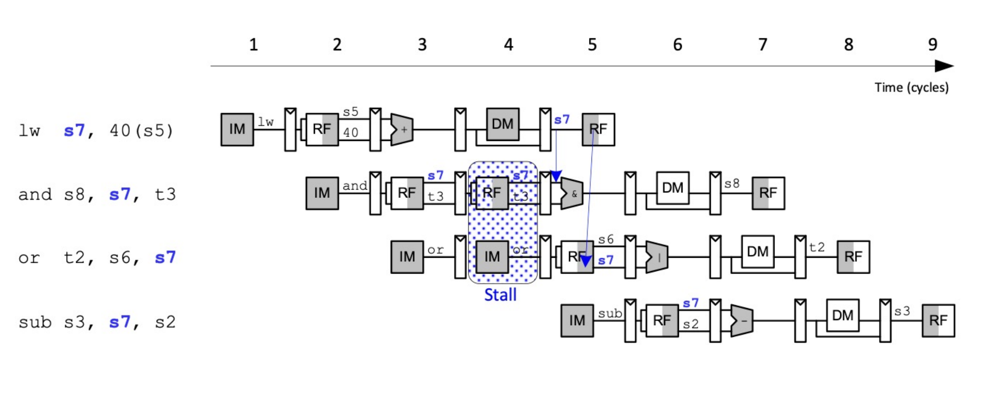

# Pipelined CPU

Also see:
- [pdf testing](https://github.com/luju1108/Team14/blob/98bc1b035346cb44bc519077c4daae0fd198ed2f/RTL/README_PDF.mdd)
- [F1 testing](link)

Pipelining uses parallelism to speed a CPU up by shortening the maximum delay between input/output of flip-flops, also known as the critical path. Indeed,  minimisation of the critical path results in a maximisation of the clock frequency, and thus results in a faster design.

Pipelining and parallelism come from overlapping CPU consecutive instructions. 

Adding pipeline registers to our Single-Cycle design allows for this overlapping of instructions, as can be seen in the diagram below:

Pipelining, however, has its own drawbacks, as it introduces dependance of a stage on a previous one. These occurrences are commonly called hazards:

- Control Hazards:
	- `FETCH` depends on `EXEC` for `BNE`
	- `FETCH` on `DECODE` for `JAL` and `JALR`
- Data Hazards:
	- `EXECUTE` might depend on already-computed but unsaved`register_write` value
	- `EXECUTE` might depend on unloaded yet value of memory with `LOAD` instructions

These problems have been addressed in the `HazardUnit`.

## Mitigating Control Hazards due to wrong speculative `FETCH`

Decisions on `JUMP` are only taken in the `DECODE` and `EXECUTE` stage. This introduces a control hazard, since the CPU's `ProgramCounter` assumes no jump is taken:

If a `JUMP` is taken, the contents of the `DECODE` and `EXECUTE` stages needs to be discarded. A `FLUSH` would then needs to come out of the `HazardUnit`:

## Mitigating Data Hazards related to already-computed but unsaved `register_write` through Forwarding

If the `InputRegisters` matches one of the two previous `WriteRegisters`,  we can fetch the the data we require from either the `MEMORY` or `WRITE` stage.

This can be done through multiplexers at the `ALU`'s inputs:

To implement `UpperImmediate` instructions, we would also need a multiplexer within the `MEMORY` stage, with input either bit of `ResultSrcM`:
- `ResultM = ALUOut` for `R` and `I` type instructions, where `ResultSrcM = 2'b00`
- `ResultM = ImmExt` for `U` type instructions, where `ResultSrcM = 2'b11`

## Mitigating Data Hazards related to unavailable`LOAD` data through Stalling

In the case of a `LOAD` instruction, if `WriteRegister` matches the `InputRegister` of the next instruction, we should `STALL` the pipeline:
- `CLEAR` the `EXECUTE` Register, as wrong operands were used within the `ALU`
- `STALL` the `FETCH` and `DECODE` stages, introducing a `BUBBLE`

> The `Pipeline Registers` write synchronously on a positive clock edge, while the `Register File` and `Data Memory` write synchronously on the negative clock edge. This spares conflicts between the two parallel write operations.

# PIPELINING SCHEMATIC

All these modifications give rise to the following schematic:

