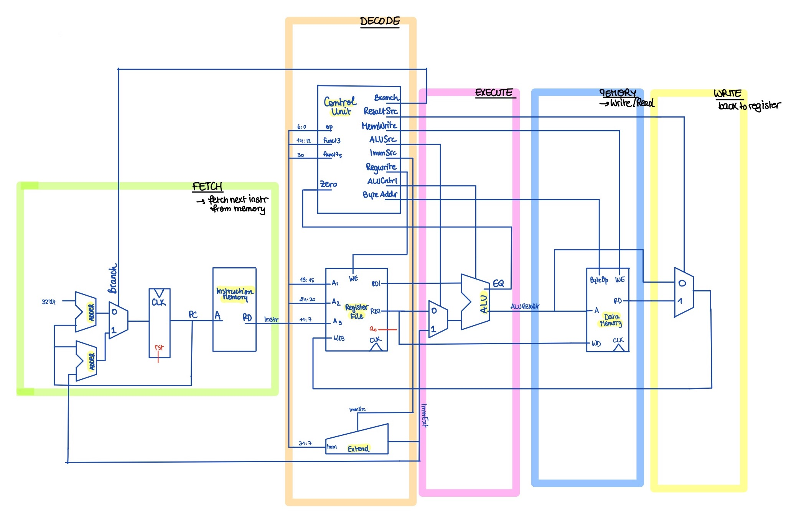

# SINGLE CYCLE RISC-V CPU

A single-cycle CPU should execute one instruction per clock cycle. During this clock cycle, the CPU should:

1. `FETCH` the instruction from memory, through the program counter and instruction memory 
2. `DECODE` the instruction, through the sign-extend unit, control unit and register file
3. `EXECUTE` the instruction, through the ALU
4. Write or Read value to `MEMORY` (potentially), through the data memory
5. `WRITE` value to registers (potentially), through the register file's write port

We chose to base ourselves off the architecture we were introduced to during the lectures and adjust it to match our specific needs, namely support additional `Jump` and `UpperImmediate` instructions.

## Implementing `JUMP` instructions

### Implementing `Branch` instructions:

Decisions regarding `Branch` instructions depend on two parameter:
- the instruction-type: whether it is a `Branch` or not
- the condition verification: whether condition for `Branch` is met, or not

Condition verification is done through the `ALU`, and fed back into the `ControlUnit`. In turn, the `ControlUnit` produces an Select Signal `Branch`, only `HIGH` when program needs to branch. We would then need to add a Multiplexer to our program Counter:
- `PCNext = PC + 4` if `Branch` is `LOW`
- `PCNext = PC + ImmExt` if `Branch` is `HIGH`

### Implementing `JAL` instructions

The team needed to consider two different facets of `JAL` instructions when reworking the schematic:
1. The unconditional jump nature of `JAL` instructions, `PCNext = PC + ImmExt` for `JAL`
2. The writing of register `rd` to contain the return address `ra = PC + 4`

The Select to `ProgramCounter`'s multiplexer was modified to now choose `PC + ImmExt` whenever there is an unconditional jump or a succesful conditional jump: `JBTaken = (Zero * Branch) + JAL`.

An additional bit was also appended to `ResultSrc` through the `ControlUnit` to augment the functionality of the result multiplexer and support the writing operation of `JAL`:
- `WD = AluOut` for `ResultSrc = 2'b00`
- `WD = MemRd` for `ResultSrc = 2'b01`
- `WD = PC + 4` for `ResultSrc = 2'b10`

These changes give rise to the following schematic:

Here, the `ControlUnit` should set the register file's write enable `WE = 1`.

### Implementing `JALR` instructions

`JALR` instructions are another type of unconditional jumps like`JAL`, except they set `PCNext = JTA = rs1 + ImmExt`.

`PCNext` can then be computed through the `ALU` by setting `ALUControl = 3'b000`. In that case, `PCNext = AluOut`.

Adding one last multiplexer to `ProgramCounter`, with Select bit `JALR` - only `HIGH` for `JALR` instructions:

Also, the `ControlUnit` should set the register file's write enable `WE = 1`.

## Implementing `UpperImmediate`

`UpperImmediate` instructions load the top 20-bits of a register. This raised two considerations:
- Modifying the `SignExtend` and `ControlUnit` by setting `ImmSrc = 3'b100` specifically for `UpperImmediate` instructions
- Adding a fourth input pin to the Result multiplexer, and setting `ResultSrc = 2'b11` specific to `UpperImmediate` instruction

The `ControlUnit` should set the register file's write enable `WE = 1`.

## Finalised Schematic

The schematic below offers a comprehensive description of our design:

