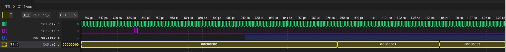

# F1 Assembly
### Aims and Introduction
This assembly program should run on a RISCV CPU without the need for data memory. The output can be observed using VBuddy’s lightbar which displays the value it receives from the CPU’s A0 output which should increment from 0b1 to 0b11 to 0b111 etc. every second. Once this output arrives at 0b1111,1111 the lights should turn off after a random delay.
### Definitions
This program makes use of registers to store any data the program requires. The following are definitions for the remaining register the F1 program uses:
Register A0 and A1 are used for function arguments and return values. The F1 program uses these for:
* _A0: output – this register is used to hold our display output value which is shown in VBuddy’s light bar._
* _A1 : pseudo random number – this register hold the return value of our random number generator routine._
Registers S1-S11 are saved registers. These can be used to store important constants which aren’t expected to be changed. The F1 program uses the following saved registers:
* _S0: expected formula lights value – this is initialised with 0xFF and the program compares the output to this register to determine whether the program has reached the end of the f1 lights sequence._
* _S1: expected wait counter value – this is initialised with 0xF and the program compares a counter with this register to determine whether a second has passed. This comparison depends on the simulations device, but the program assumes that it takes approximately 1 second to run 15 (0xF) cycles._
* _S2: expected trigger value – this is initialised with 0x1 and the program compares the trigger value to this **register** to determine whether or not to start the f1 sequence._
* _S3: trigger – this register has been saved to hold the value of the trigger. This controlled through VBuddy’s rotary encoder. The testbench reads whether the value of the encoder is greater than 50, in which case the trigger (register S3) is set high._
Registers T0-T6 are temporary registers. These can be used to store temporary values which are used to carry out calculations or to hold intermediate values. The F1 program uses the following temporary registers:
* _T0: F1 shift increment – this is initialised with 0x1 and is shifted left by 1 after every 1 second delay. This is used to increment the output register (A0)._
* _T1: counter for 1 second delay – this register is incremented until it reaches the value held in register S1 (0xF). This allows us to create a ~1 second timer._
*  _T2: counter for random delay – this register is incremented until it reaches the value held in register (A1) which is a pseudo random number. This allows us to create a random timer._
### Program in R32I assembly
The F1 program can be broken down into sever functions as follows:
``` .asm
define_pseudonumber:
    bne a1, zero, default
    addi a1, zero, 0xF
```
This function is used to initialise register A1 with a seed value for our random number generator. It is also require that this register doesn’t hold 0 since this is not a valid for the random number generator. Such a case can be ruled out by the conditional branch which ensure that a1 cannot hold 0.
```.asm
default:
    addi s0, zero, 0xFF
    addi s1, zero, 0xF
    addi s2, zero, 0x1
    addi t0, zero, 0x1
    addi t1, zero, 0x1
    addi t2, zero, 0x0
```
This function is used to initialise saved and temporary registers with their expected values.
```.asm
reset:
    add a0, zero, zero
```
This function is used to reset the output value. This simply done by setting output register A0 to 0.
```.asm
wait_trigger:
    bne s3, s2, wait_trigger
```
This function is used compare the value of the trigger (held in S3) to its expected value (held in S2). If these two are not equal, this function loops. Essentially this function waits until the trigger is asserted. If trigger goes high, the program moves on the F1 sequence.
```.asm
f1lights:
    jal ra, wait_second
    add a0, a0, t0
    slli t0, t0, 0x1
    bne a0, s0, f1lights
    jal ra, turn_off_f1
```
This is the main functions which increments the output. Firstly, the program must wait for 1 second so it uses a jump and link to the wait_second function. Once the wait_second function returns, the program adds the value held in T0 (initialised to 0x1) to the output becomes 0x0 + 0x1 = 0x1. This would effectively light up the first LED on the VBuddy light bar. Next the temporary value held in T0 is shifted left by 1. This is done to increment the output value in the next loop. The next instruction is a loop where the output (A0) is compared to the expected output value saved in register S0. If these two do no match, the function loops back to the start of the function where the program waits for 1 second. This function exits when the output reaches 0xFF and goes to the turn_off_f1 functions.
```.asm
wait_second:
    addi t1, t1, 0x1
    bne t1, s1, wait_second
    addi t1, zero, 0x0
    jalr zero, ra, 0x0
```
This is a timer function which increments the temporary value in T1 by 1 and loops until T1 holds 0xF. This process takes approximately 1 second. Once this loop terminates, T1 is reset to 0x0 and the function returns to the F1 sequence using the jump and link instruction.
```.asm
random_delay:
    andi t3, a1, 0x8
    srli t3, t3, 3
    andi t4, a1, 0x4
    srli t4, t4, 2
    xor t3, t3, t4
    slli a1, a1, 0x1
    andi a1, a1, 0xF
    add a1, a1, t3
    jalr zero, ra, 0x0
```


When called, this function implements a 4 bit linear feedback shift register to generate pseudo random numbers. In the first instruction the 4th bit held in register A1 (random number seed value) is extracted and stored in temporary register t3. This is then shifted logically to the right by 3 so that the extracted value is the least significant bit. Similarly, the 3rd bit of A1 is extracted stored and shifted into temporary register T4. T4 and T3 are then xor-ed with the result being stored in T3. Next, A1 is shifted left by 1 as well as and-ed with 0xF to ensure that A1 continues to hold a 4bit number. The least significant bit of A1 is then replaced with the 1-bit number held in T3. A1 now holds the next pseudo rando number and the function returns.

The pseudo random numbers generated by this function have a set periodic sequence (period of 15).
TODO include image of waveform showing the sequence of number produced


```.asm
wait_random_delay:
	addi t2, t2, 0x1
    bne t2, a1, wait_random_delay
    jalr zero, ra, 0x0
```
This function is very similar to the wait second function. It is a timer which lasts for the amount held in A1 which is a random number.
```.asm
turn_off_f1:
    jal ra, random_delay
    jal ra, wait_random_delay
    add a0, zero, zero
```
Lastly this function, which is called when the F1 sequence terminates, calls the random number generator and the random delay timer. When these two functions return, the output A0 is set to 0x0 which effectively turns the light bar off.

Observe the following waveforms:


It is clear to see that the output is incrementing as expected from 0b0000,0000 to 0b0000,00001 to 0b0000,0011 etc. It is also clear to see that the output only changes with a regular set period. 

To run the program once again, the reset input can be asserted which set the program counter back to 0. This calls the define pseudonumber function. Which checks if A1 hold 0. Since reset does not change register values, when the program is called again using the trigger, the F1 lights turn off with a random delay since the seed value is different.

These results can be observed in the following youtube clip of the F1 Sequence running: 
[click here](https://www.youtube.com/watch?v=zJto4plLvCE)

