## Single cycle cpu reference program on pdf testing

### Overview
Before testing upon the program on the probabily distribution function, the single cycle cpu is first tested on the F1 program that is easier to debug to make sure that the instruction operation works. 

Now given that the F1 program works, the team decides to first examine the given reference pdf program of the following instructions on the gaussian value. 


Initially the team uses this first verion of the c++ testbench (without Vbuddy plotting):

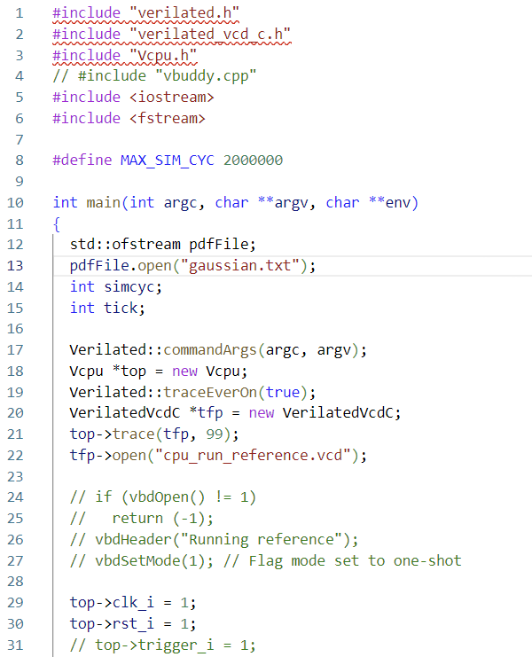


With this test bench code, the stimulation result writes into the vcd files and is examined using GTKWave to work out whether the single cycle cpu works as required:

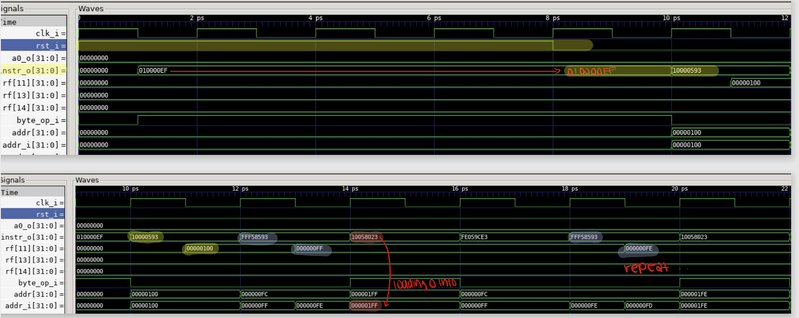

Above shows the initial setting up of the distribution, corresponding to the instruction section of the init function to initialise PDF buffer memory (in other words, initialising the values in the pdf_array section of the data memory to 0).

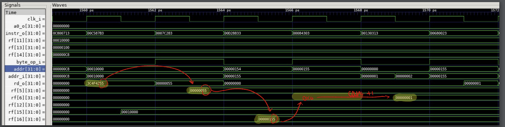

1560/2 = 780 clock cycles later, with all of the 256 values of the pdf_array now set to 0, and after the initialisation of the constant values at a1, a2, a3 and a4, the program is now in progress of updating the pdf_array. This is done by reading the values in words from the given gaussian data that is imported into data_array from address `0x10000` to` 0x1FFFF` in the data memory and counting the number of occurances of each byte. In the example above, the first 4 byte in the gaussian data is` 55 42 4F 3C`. This is stored as `3C 4F 42 55` in the data memory, with its first reading to be the least significant byte in the word. Then take the first reading at address offset 0 of the value 55, the program goes to its corresponding pdf position at address `0x155`, and it increments the stored count value by 1. In other words, in this case, the number of occurences of 55 stored in `0x155` is incremented from 0 to 1. 


Following the above instructions to update the pdf_array, the program exits the build function when a byte occurs more than 200 times, the maximum count number being set. As shown in the image above, this byte is `6B` in the word `7C 75 6B 9B`. 

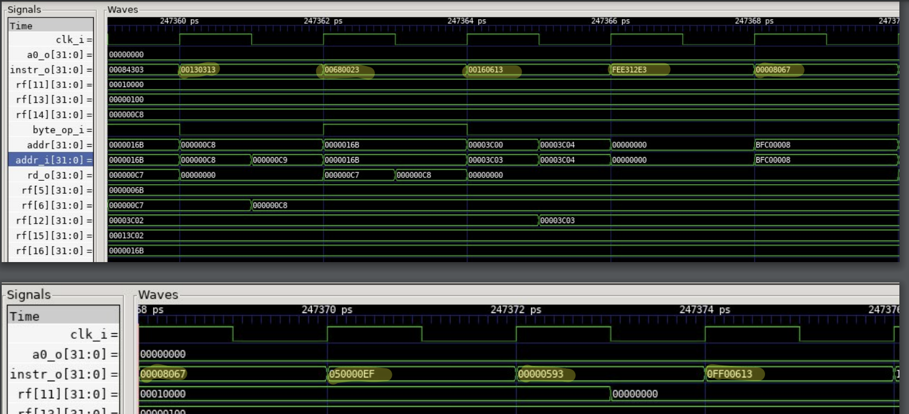

Above shows all the jumping steps between ending the update of the pdf_array and the starting of reading it. 


The program is now in the reading stage of the pdf_array. At each address in the pdf_array, the stored value is the number of occurence of the byte value corresponding to the least two byte of the address, and this occurence value is loaded into a0_o, an output in the single cycle cpu. The top section of this image shows the reading of the occurence of byte `00`, stored in `0x100`, and this value is 0. Another example to a non 0 occurence is shown in the bottom section of the image, where the reading of occurence of byte `05`, stored in `0x105` is 2. There is an important information here that is used later to modify the testbench: as indicated in the image, it takes 3 clock cycles for each reading. 

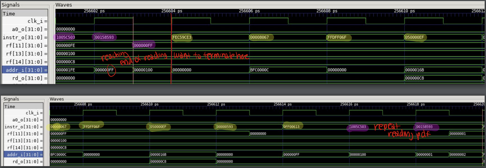

As shown in the top section of the above image, the program ends the reading of the pdf_array when the address hits its boundary of `0x1FF`. It then follows a series of jump instructions and repeats and read the pdf_array again starting at `0x100`. 


### New features added 

Now having the whole pdf program being evaluated and examined, modification to the test bench (still without Vbuddy plotting) and new features need to be added to the instruction to test the accuracy of pdf generation and hence the correctness of the single cycle cpu being written. 

1. Detecting that the program is reading from the pdf_array

    The test bench needs to know when the program starts reading from the pdf_array and when should it start to output values into the txt file to be plotted. 

    Since `a0_o` in this program can never be as high as the unsigned value `0xFFFFFFFF`, or equivalently signed `-1`, this is chosen to be the value ready to be detected once the reading of the pdf_array starts. Hence, the instruction is modified as of below, with 

    ```
    LI      a0, -1              # output to testbench - start display
    ```  

    added in line 39 to the display function, and everything else kept the same:

    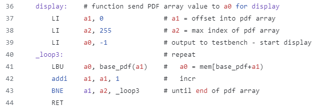

    Correspondingly, the following is added to the test bench:

    ``` C++
    if (top->a0_o == -1)
    {
        currentlyReading = true;
    }
    ```

2. Modifying test bench to let it know what value is to be exported into to the txt file and when to stop the program 

    As mentioned before, in the pdf_array reading loop, each reading of the occurences of the byte takes 3 cycles, hence every 3 clock cycle, the output `a0_o` only gets written once at the correct timing into the txt file:

    ``` C++
    if (currentlyReading)
    {
        cntReading++;
        if (cntReading % 3 == 2)
        {
            pdfFile << top->a0_o << "\n";
        }
    }
    ```
    
    Also since the value of byte ranges from `0` to `0xFF`, which there are 256 of them in total, this takes 256 * 3 clock cycle to complete the read, so hence the program is exited after such number of clock cycles and the last read occurs at 0x1FF, where `a0_o` is the number of occurencies of `FF` in the given data:

    ``` C++
    if (cntReading > 256 * 3)
        break;
    ```


### Testing of the accuracy of the pdf generation

The first test is on the gaussian distribution, using the single cycle cpu with the new feature added instruction code and the modified C++ test bench (without Vbuddy plotting). 

A [python code](https://github.com/luju1108/Team14/blob/6f943a7ff841b05931256c90f58ef241f779b7cb/RTL/plot_distribution.py) was written to plot the graph of the values stored in the txt file. Each of the values in the txt file indicates its value on the y-axis and its correpsonding x-axis value is its equivalent position number (ie 1 for the 1st value in the txt file). 

Result is shown below:


Another python code, as shown below, is written to test the correctness of the Gaussian cpu pdf being generated above. It does the same instructions as the reference instruction given to the single cycle cpu. It first reads all the input data from the given Gaussian file, counts the number of occurences of each byte until one of the occurrences reaches 200, then compares its value with the gaussian occurrence txt file generated by the single cycle cpu. 


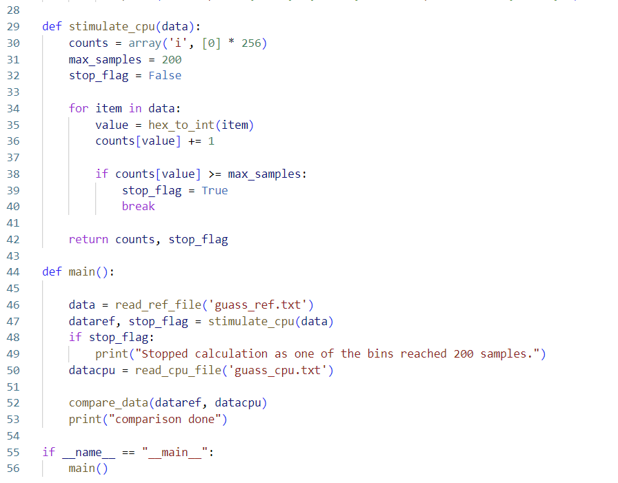

After running the python comparison program and repeat such method to all given data of distributions (Guassian, Triangle, Noisy and Sine), no inequivalence nor error is reported, hence it confirms that the single cycle cpu runs correctly on the reference pdf instruction and gives the correct output. 


Overall result plots obtained from running the single cycle cpu:

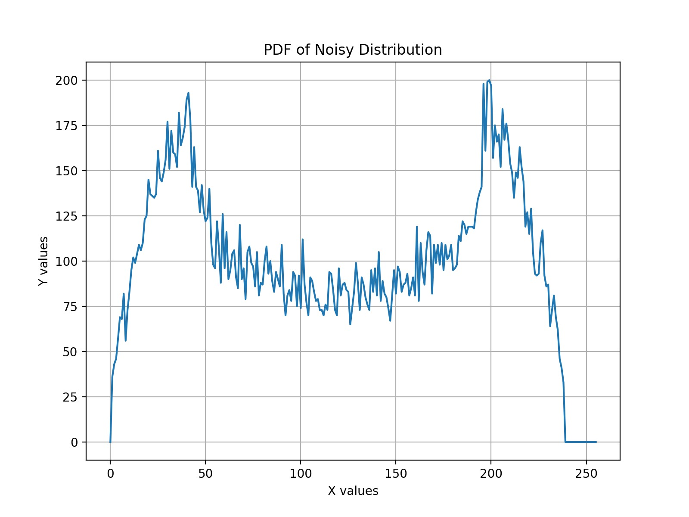
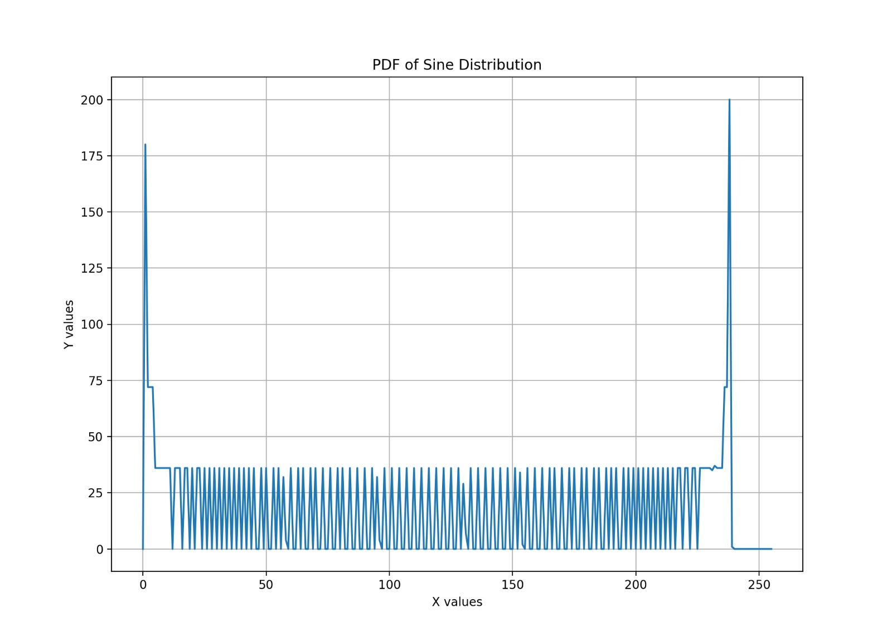
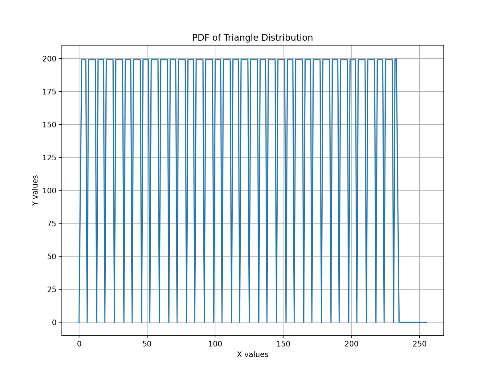


### Moving into plots of y-axis as a probability

Through out all this write-up, the results from the single cycle cpu are mentioned as pdf, however it is not precise enough, because the results are only related to the number of occurences of the byte values. The actual probability distribution function should be related to the probability of occurrences of the byte values instead. 

Our team decides to also plot actual PDF of the probability of occurences of the byte values (number of occurences divided by the total number of bytes in the txt data file) using the following python code:

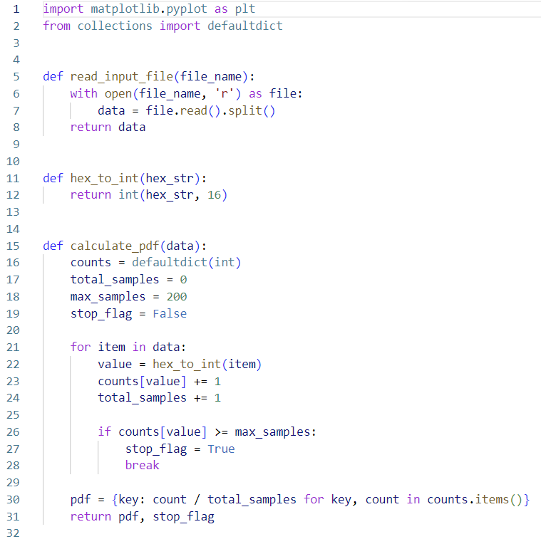
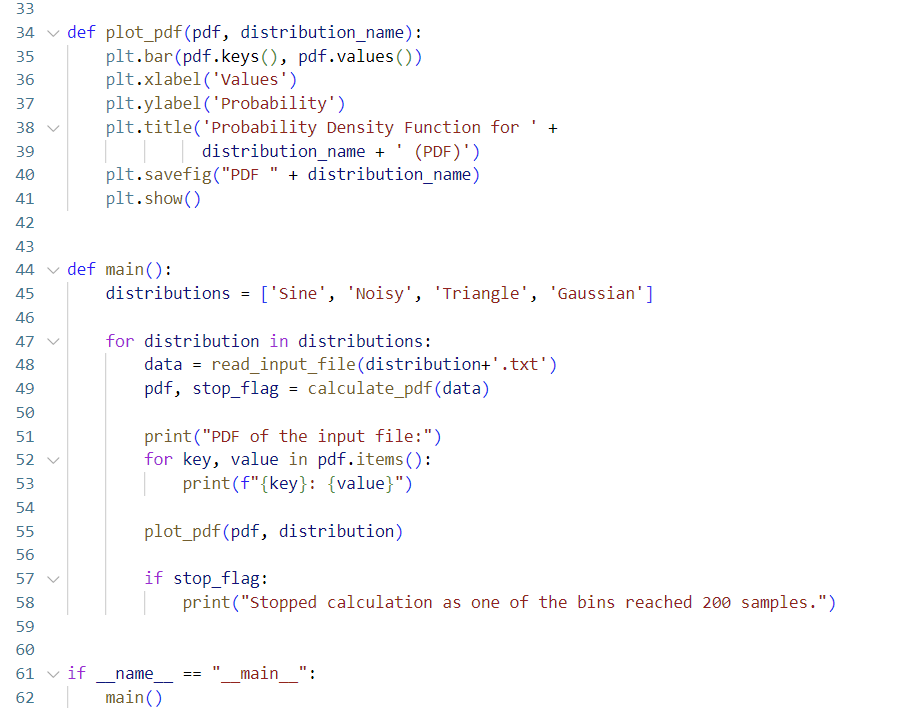

Results should have the same shape as the occurences of byte values plot from the single cycle cpu, but having the y-axis as a probability instead:

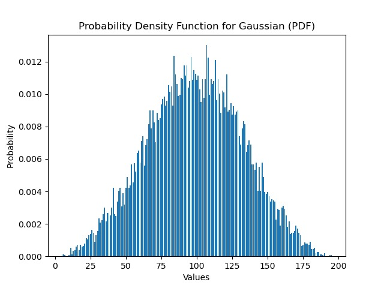
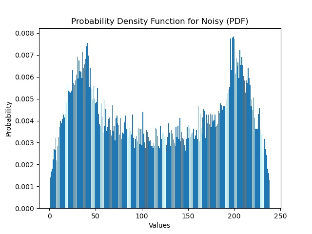

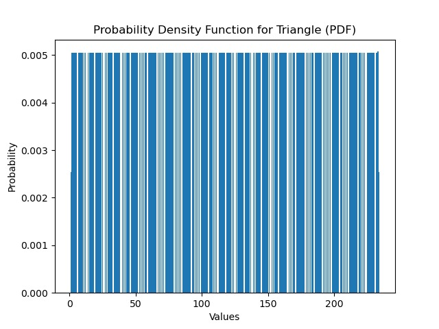


