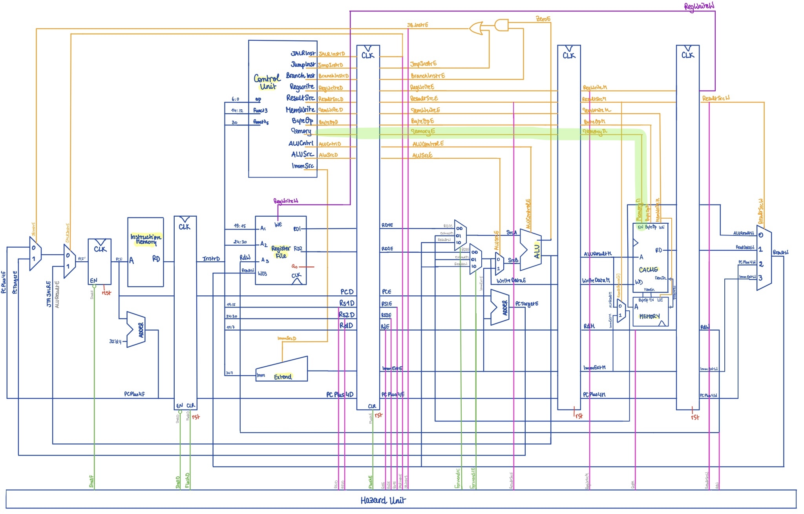

## Refactoring for Control Unit for Cache

The team first settled on designing a simpler direct-mapped cache.

Some modifications had to implemented in regards to our pipelined CPU.s

The Control Unit had to be modified to activate the Cache only in the case of `MEMORY` related instructions. This new feature allows us to bypass the bogus values that would have accounted for write and misses if cache was always activated.

The pipelining registers also had to be modified to extend that `MEMORY_ENABLE` to the pipeline's `MEMORY` stage where the actual access/loading to cache takes place.

