## Data_hazard unit

### Type of hazards
There are 2 main type of pipeline hazard:
1. Data hazard: when register value is not yet written back to the register file
    Methods to solve:
    - NOP
    - Forwarding
    - Stalls

2. Control hazard: when the next instruction is not yet decided, and is caused by branch 
    Method to solve:
    - Flushes

### Data hazard solving by NOP and forwarding 
First consider the following data hazard:

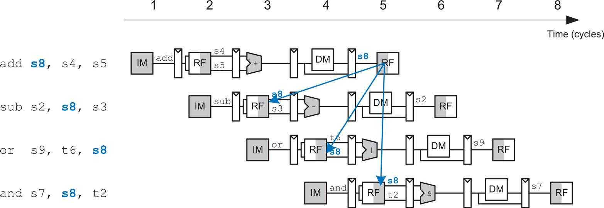

This is leads to a hazard because for example, looking at the first add instruction and the second sub instruction, while the value in s8 gets updated cycle 5 due to the add, the sub instruction needs this subsequent value in s8 earlier in cycle 3. 

One of the method to solve such hazard is using NOP, waiting for the results from add to appear in the resgitser file in the subsequent sub instruction, as shown in the following:

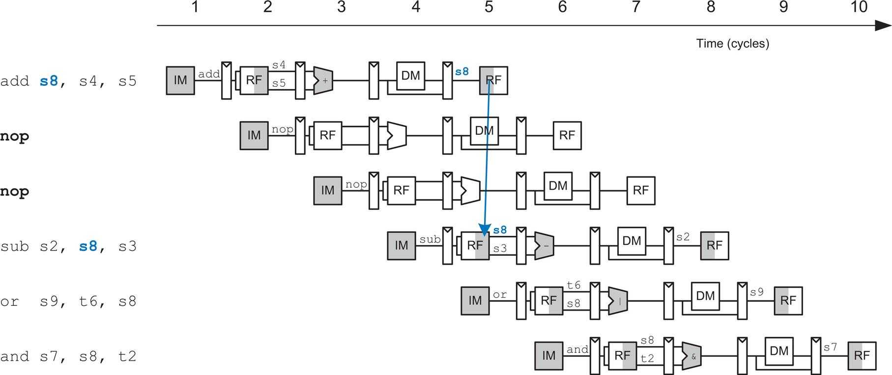

However, this method is not ideal because the waiting time slows down the overall operation and this method will not be used in our team's written pipeline cpu. 

Alternatively, this hazard can also be solved by fowarding as shown below:

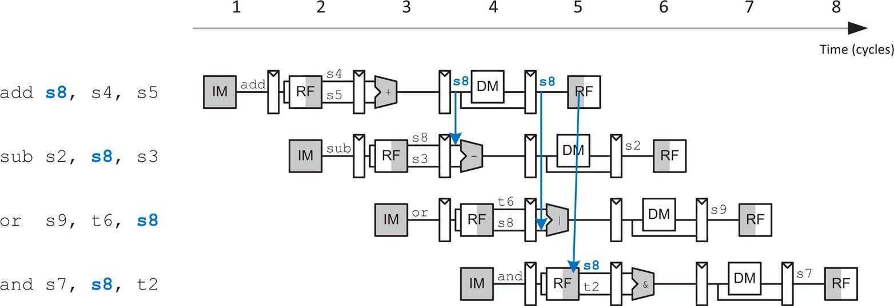

Unlike NOP, forwarding method does not waste cycles. It is needed when an instruction in the excute stage has a source register matching the destination regsister of an instruction in the memory or writeback stage. 

As implemented from line 15 to line 30 in [hazard_unit.sv](https://github.com/luju1108/Team14/blob/6d86288b86654a54aea3fa2fddb1fdfeb3c1c59b/RTL/hazard_unit/hazard_unit.sv), two forwarding multiplexers (mux), one for input data1 and one for input data2 into the alu, is needed. Variables `forward1_e_o` and `forward2_e_o` are the selection source of each mux. 

Variables:
- `rs1_e_i`: 
    - the address of data1 being used as an input into the alu
- `rd_m_i`: 
    - in the same cycle, the destination write address (of the previous instruction) in the memory stage
- `rd_w_i`: 
    - in the same cycle, the destination write address (of the pre-previous instruction) of the writeback stage


`forward1_e_o ` | Condition                                               | Implication
--------------|---------------------------------------------------------|-----------------
`2'b00 `        |No dependent on previous instruction used registers      | No forward needed, <br> use the data from register file as usual
`2'b01`         |(`rs1_e_i` == `rd_m_i`) && `reg_write_m_i` && (`rs1_e_i` != 0)   |Forward from memory stage result, <br>when memory stage write is enabled, <br> corresponding to the arrow from the first add to the second sub instruction in the image of data hazard above
`2'b10`         |(`rs1_e_i` == `rd_w_i`) && `reg_write_w_i` && (`rs1_e_i` != 0)   |Forward from writeback stage result,   <br> when writeback stage write is enabled, <br> corresponding to the arrow from the first add to the third or/ forth add instruction in the image of data hazard above
`2'b11`         |N/A                                                      |N/A

(`forward2_e_o` is similar to above, changing all sources from 1 to 2)

> Note that in the above condition, `AND` gate with (`rs1_e_i` != 0) is needed, because when the current register address is `0x0`, there is no need of the forwarding, as the value always stays 0 at this zero register.

In linking `forward1_e_o` and `forward2_e_o` in the cpu, it is used in the [execute_stage.sv](https://github.com/luju1108/Team14/blob/6d86288b86654a54aea3fa2fddb1fdfeb3c1c59b/RTL/datapath/execute_stage.sv) as the following, corresponding to the description of the implication above

``` SystemVerilog
case(forward1_e_i)
    2'b00:  src1 = rd1_e_i;
    2'b01:  src1 = result_m_i;
    2'b10:  src1 = result_w_i;
    default: src1 = {DATA_WIDTH{1'b0}};
endcase

case(forward2_e_i)
    2'b00:  write_data_e_o = rd2_e_i;
    2'b01:  write_data_e_o = result_m_i;
    2'b10:  write_data_e_o = result_w_i;
    default: write_data_e_o = {DATA_WIDTH{1'b0}};
endcase
```

> Note that now `src1` and `write_data_e_o` are seen as the output value from the corresponding registers, at the execute stage, pipelined into the alu stage. Note that `forward2_e_i`, the related output value is named `write_data_e_o` because:

- If this value is used in the alu, it needs to go through another mux:

    ``` SystemVerilog
    src2 = alu_src_e_i ? imm_ext_e_i : write_data_e_o;
    ```
    and both `src1` and `src2` are input for the arithemetic instruction to form `alu_result_o` ready to be pipelined into the next stage:

    ``` SystemVerilog
    alu #(DATA_WIDTH) execute_alu (
        .src1_i(src1),
        .src2_i(src2),
        alu_result_o(alu_result_e_o)
    ...
    ``` 

- On the other hand, this value in the execute stage may be pipelined into the memory stage without going through the alu, if the current instruction is a store instruction:

    ``` SystemVerilog
    execute_stage #(DATA_WIDTH) pipeline_execute_stage (
        .write_data_e_o(write_data_e),
    ...

    memory_register #(DATA_WIDTH, REG_ADDR_LENGTH) pipeline_memory_register (
        .write_data_e_i(write_data_e),
        .write_data_m_o(write_data_m),
    ...

    data_memory pipeline_data_memory (
        .wd_i(write_data_m),
    ...
    ```

    above is the pipelined equivalent of the following;

    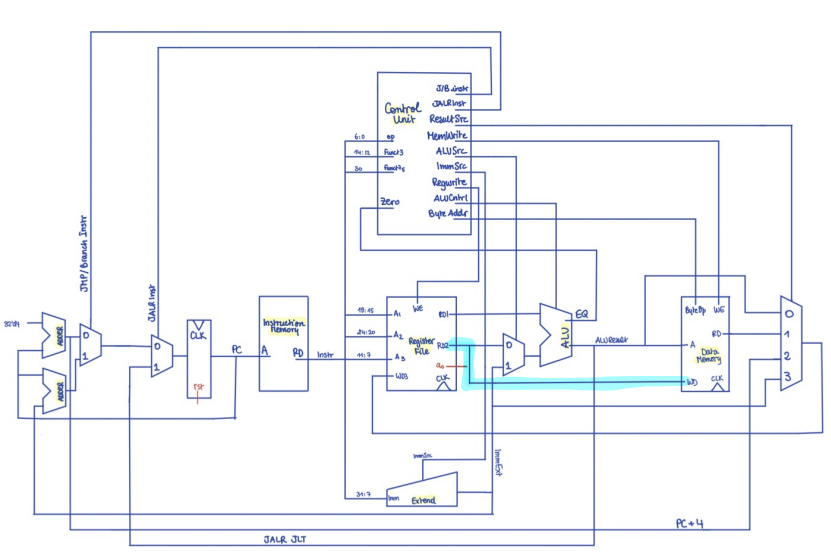 *schemetic drawn by Sara, highlighted by Lu
    
<br>

This avoid the same data hazard when the current store instruction is dependent on the result of another previous instruction that uses the same register file and has not yet completed. (An case that is not illustrated in the above example involving `add`, `or` and `sub` instructions)

In the overall schemetic, the above forwarding is in the following highlighted section:

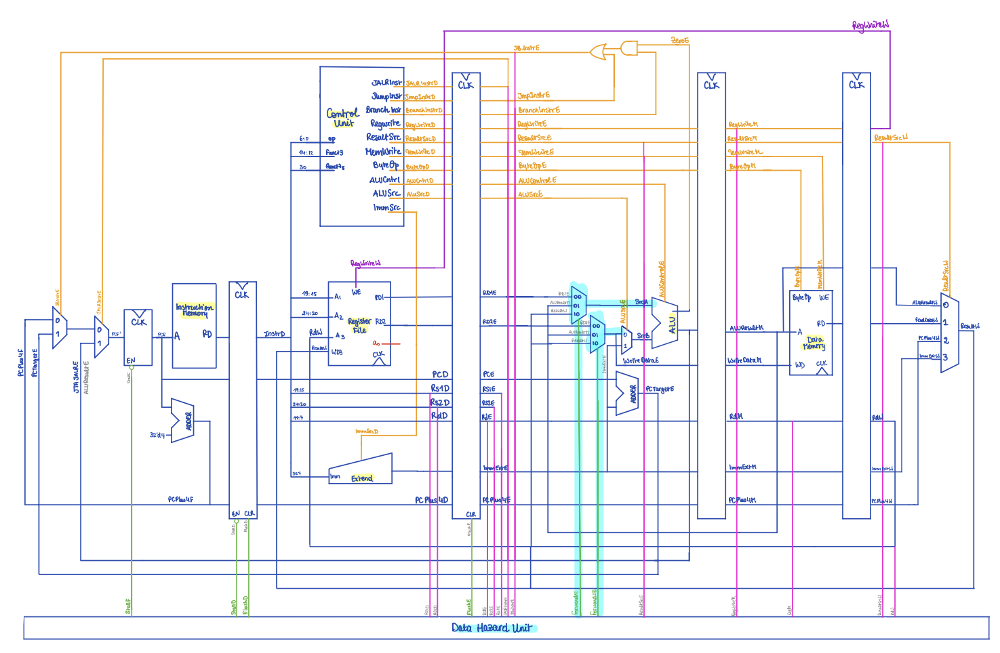 *schemetic drawn by Sara, highlighted by Lu

<br>

### Data hazard solving by stall
However, the forwarding method is not enough to solve the data hazard, the stall method is needed. Consider the following case:

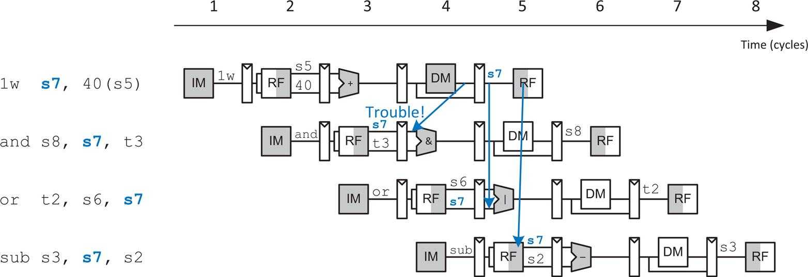

> Note that while load instructions will face the above issue, on the other hand, the similar store instruction does not write results into the register file, and hence does not need do to a stall. Instead it writes into earlier the memory stage, which occurences of data hazard can be deal with the forward method. 

Below shows using stall (in other words, holding up the data) to avoid data hazard from dependency on the load instruction.

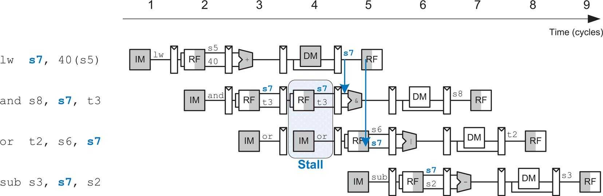

There are two stages that might require a stall:
`stall_d_o`: enables a stall in the decode state
`stall_f_o`: enables a stall in the fetch state
<br>

Whether or not a stall is required is determined by the following, when all satisifed 
1. In the execute stage of the current instruction (the same cycle when the next instruction is fetched), the current instruction is a load instruction (in preperation of loading the value from data memory into registerFile in the writeback stage), determined by `result_src_e_i`, as highlighted in the following 

    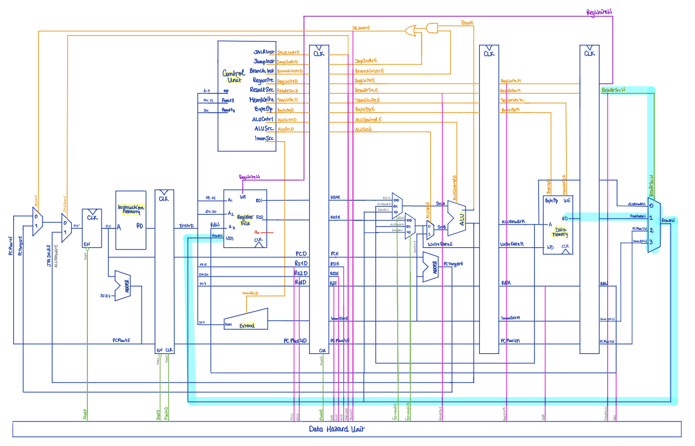 *schemetic drawn by Sara, highlighted by Lu

2. When the load instruction's desination register matches with the using registers in the decode stage 

> Note that when the current cycle's decode stage requires a stall, the current cycle's fetch stage must also have a stall so that no subsequent instructions are lost.  

Hence to implement the stall:

``` SystemVerilog
lw_stall = ((result_src_e_i == 2'b01) & ((rs1_d_i == rd_e_i) | (rs2_d_i == rd_e_i)));
stall_f_o = lw_stall;
stall_d_o = lw_stall;
``` 

To be more thorough in making sure the stall is correctly done with no extra information being propogated forward, flush enabling is introduced. The effect of flush is to clear the contents of the corresponding stage. In this case of a stall, observe that the in the cycle of the stall, there is no execute stage, and thus it is essential to flush it. This is implemented as below:

``` SystemVerilog
flush_e_o = lw_stall | flush_d_o;
```

(`flush_d_o` is related to the control hazard which will be the next type of hazard discussed)

In combining the stalls and the flush into the cpu: 
``` SystemVerilog
pc #(DATA_WIDTH) pipeline_program_counter (
    .en_i(~stall_f),
... 

decode_register #(DATA_WIDTH) pipeline_decode_register (
    .en_i(~stall_d),

execute_register #(DATA_WIDTH, REG_ADDR_LENGTH) pipeline_execute_register (
    .rst_i(flush_e|rst),
...
```

With specific implementation:

In [pc.sv](https://github.com/luju1108/Team14/blob/6d86288b86654a54aea3fa2fddb1fdfeb3c1c59b/RTL/program_counter/pc.sv), preserving the fetched pc value for another cycle if not enabled (stalled)
            
``` SystemVerilog
if (en_i)
    case (jalr_e_i)
        1'b0: pc_next <= jb_taken_e_i ?  (pc_target_e_i) : (pc_next + 32'd4);
        1'b1: pc_next <= jta_jalr_e_i;
    endcase
```

In [decoder_register.sv](https://github.com/luju1108/Team14/blob/6d86288b86654a54aea3fa2fddb1fdfeb3c1c59b/RTL/pipeline_registers/decode_register.sv), preserving the decoded value for another cycle if not enabled (stalled)
``` SystemVerilog
if (en_i) begin
    instr_d_o <= instr_f_i;
    pc_d_o <= pc_f_i;
    pc_plus4_d_o <= pc_plus4_f_i;
end
``` 

In [execute_register.sv](https://github.com/luju1108/Team14/blob/6d86288b86654a54aea3fa2fddb1fdfeb3c1c59b/RTL/pipeline_registers/execute_register.sv), line 43 to 64 clears all the output into 0 and update it in the next cycle. This is equivalent as a reset when no performances is wanted in the execute stage during the stalled cycle. 

<br>

### Control hazard
Now the other hazard is the control hazard: consider below case: 

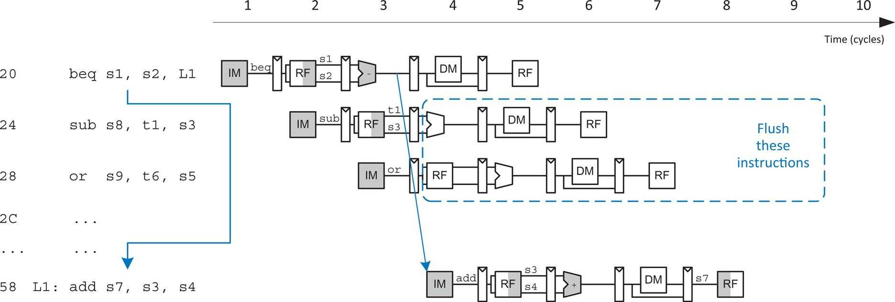

Flushing of stages starts after cycle of the determination of a jump (in this case all flush of following instructions occur at cycle 4, after its execution stage at cycle 3 in determining the jump; in other words, the coding of telling the program to flush occurs at cycle 3, and cycle 4 is when the actual values are being reset and updated into 0). 

Using the above as an example, let's first look into cycle 3. 
- in this execution cycle of `beq`, values related to the branch: `jalr_e`, `jb_taken_e`, `alu_result_e` and `pc_target_e` are obtained.
- those values are then used in the fetch stage of the instruction that is 2 head of `beq`, the `or` instruction, where the jumped pc position is obtained. 
- the decode stage of the next instruction `sub` is useless here and does not contribute to anything due to its flushed execute stage in the next cycle

The flush is implemented as the following in this cycle 3, so that the when the values are passed into cycle 4, they have been reset.

``` SystemVerilog
flush_d_o = jalr_e_i | jb_taken_e_i;
flush_e_o = lw_stall | flush_d_o;
```

In cycle 4, the `beq` instruction now goes into the memory stage and this is when the execution stage of next `sub` instruction and decode stage of next-next `or` instruction needs to be flushed
- flushing the execution stage of the next `sub` instruction makes sure that no extra actions is propogated forward, so it does not contribute to any of the results, and neither will its previous decode stage will have a meaning. 
    - on top of this, this means that `jalr_e`, `jb_taken_e`, `alu_result_e` and `pc_target_e `are now all set to 0, meaning for that the fetch stage in this cycle correponds to the `L1: add` instruction, as PC is updated as the previous target PC obtained from the jump + 4. 
- similarly, flushing the decode stage of the `or` instruction makes sure no value is propogated forward neither, equivalently this instruction is being ignored. 

<br>

### Testing the data hazard unit
Before moving into the reference program or the F1 program, 3 data hazard tests are conducted:

All below uses the same [testbench](https://github.com/luju1108/Team14/blob/14d268169e6d2222e371d4ec24bd981f4d1f9bb2/RTL/hazard_unit/hazard_unit_tb.cpp) and the same [shell script](https://github.com/luju1108/Team14/blob/14d268169e6d2222e371d4ec24bd981f4d1f9bb2/RTL/hazard_unit/do_hazard_unit_tb.sh):

1. Data hazard test involving use of forwarding

    Prior to the test, some modification of the initial condition to the data memory:
    ``` SystemVerilog
    initial begin
        data_ram[32'h100] = 3;
    end
    ```

    The instructions to be tested:
    ``` SystemVerilog
    addi t0, zero, 0xFF     #t0 = 0xFF, 
    addi t1, zero, 0x100    #t0 = 0xFF, t1 = 0x100
    add t1, t0, t1          #t0 = 0xFF, t1 = 0x1FF
    sub a0, t1, t0          #t0 = 0xFF, t1 = 0x1FF, a0 = 0x100
    and a0, t0, t1          #t0 = 0xFF, t1 = 0x1FF, a0 = 0xFF
    addi a2, zero, 0        #t0 = 0xFF, t1 = 0x1FF, a0 = 0xFF, a2 = 0
    lbu a0, 0x100(a2)       #t0 = 0xFF, t1 = 0x1FF, a0 = 0x3,  a2 = 0
    ```

    Working out by hand on how it should be pipelined with forwarding:
   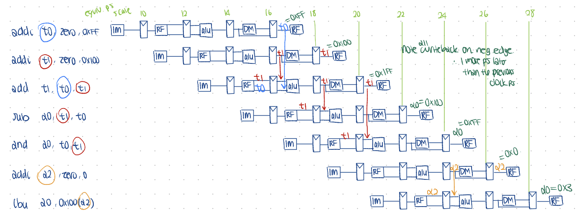

    Comparing results in vcd file:
    - it works and values correspond to the above working out at the correct write_back stage in the correct cycle
    
    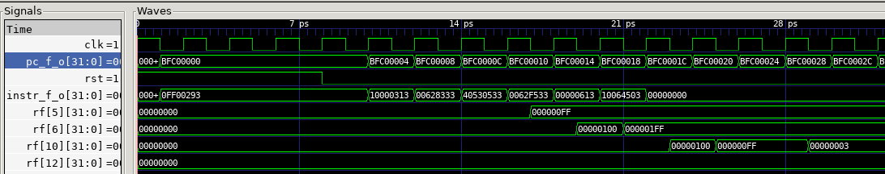


2. Data hazard test involving use of stalls

    Same initial setting to the data memory:

    ``` SystemVerilog
    initial begin
        data_ram[32'h100] = 3;
    end
    ```

    The instructions to be tested:

    ``` SystemVerilog
    addi t1, zero, 0x2      #t1 = 0x2
    lw t0, 0x100(a2)        #t1 = 0x2, t0 = 0x3
    and a2, t0, t1          #t1 = 0x2, t0 = 0x3, a2 = 0x2
    or t1, t1, t0           #t1 = 0x3, t0 = 0x3, a2 = 0x2
    sub t1, t0, a2          #t1 = 0x1, t0 = 0x3, a2 = 0x2
    ```

    Working out by hand on how it should be pipelined with forwarding:
    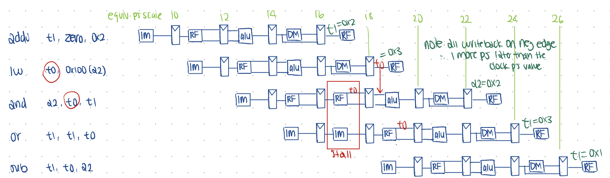

    Comparing results in vcd file:
    - it works and values correspond to the above working out at the correct write_back stage in the correct cycle
    - stalling is clearly observed at 16 ps, where the pc value and the instruction are hold for two clock cycles
        


3. Data hazard test involving use of flush

    The instructions to be tested:
    
    ``` SystemVerilog
        addi t0, zero, 0x2      #t0 = 0x2
        addi t1, t0, -1         #t0 = 0x2,        t1 = 0x1
        addi t0, t0, -3         #t0 = 0xFFFFFFFF, t1 = 0x1
        bne  t0, t1, L1          
        addi t1, t0, -1         #N/A
        addi a7, zero, 0x4      #N/A
        sub  a7, a7, t1         #N/A
    L1: addi a7, zero, 0x5      #t0 = 0xFFFFFFFF, t1 = 0x1, a7 = 0x5
    ```

    Working out by hand on how it should be pipelined with flush:
    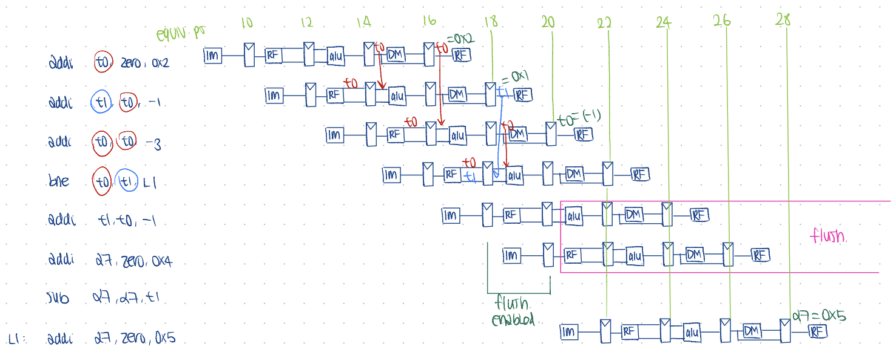

    Comparing results in vcd file:
    - it works and values correspond to the above working out at the correct write_back stage in the correct cycle
    - flush is enabled at 18ps and in 20ps the correct pc value is fetched for the jump
    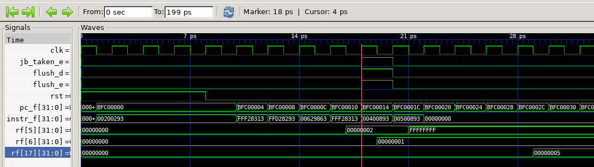


    


