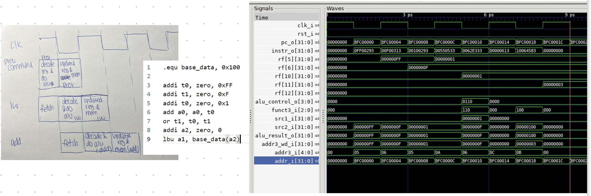

## Personal Statement: Lu Ju - CID 02198501 

### What I Contributed to
> links are to the example commits I have done, the related files are not necessary the final version

#### Overall
- policy decisions such as creating branches and protecting branches
- in charge of the git rebase and git merge 

#### Written READMEs for the parts I have the major contribution in 
- [alu](https://github.com/luju1108/Team14/blob/55573bf5cd5188fad616eb12a406bb40f62c1772/project/dataPath/alu/README.md)
- [data_memory](https://github.com/luju1108/Team14/blob/55573bf5cd5188fad616eb12a406bb40f62c1772/project/dataPath/dataMem/README.md)
- [register_file](https://github.com/luju1108/Team14/blob/55573bf5cd5188fad616eb12a406bb40f62c1772/project/dataPath/registerFile/README.md)
- [data_path](https://github.com/luju1108/Team14/blob/55573bf5cd5188fad616eb12a406bb40f62c1772/project/dataPath/README.md)
- [top_tb](https://github.com/luju1108/Team14/blob/55573bf5cd5188fad616eb12a406bb40f62c1772/RTL/README_TB.md)
- [single cycle pdf testing](https://github.com/luju1108/Team14/blob/55573bf5cd5188fad616eb12a406bb40f62c1772/RTL/README_PDF.md)
- [data hazard](https://github.com/luju1108/Team14/blob/1ac6203f9dc9e9ce10d48f2375bfcd4949d704cc/RTL/hazard_unit/README.md)
- [pipeline pdf testing](https://github.com/luju1108/Team14/blob/98bc1b035346cb44bc519077c4daae0fd198ed2f/RTL/README_PDF.md)
> alu, data_memory and register_file proof read by Sara and she added the testing sections

#### Single cycle CPU putting all together
- wrote the [top testbenches, initial version](https://github.com/luju1108/Team14/commit/5794d35894941ef1104561ef1b96bbef06ff9b37) of cpp files 
    - with [modification, for example](https://github.com/luju1108/Team14/commit/a4496032fbc678f2de1be917b62bb6b2d1034726#diff-26ba8f6b1aecb36d9d303f70221d6755443c2a8cbaaf2c120315d9de0c64e5df)
- wrote the [initial simple shell script](https://github.com/luju1108/Team14/commit/5794d35894941ef1104561ef1b96bbef06ff9b37) to run the cpp files 
- together with team [testing and debugging on the pdf](https://github.com/luju1108/Team14/commit/a4496032fbc678f2de1be917b62bb6b2d1034726)
    - [added features to the reference program](https://github.com/luju1108/Team14/commit/ca8ba43fc3f1b9c6ec5b4942984968ecc04192b1#diff-26ba8f6b1aecb36d9d303f70221d6755443c2a8cbaaf2c120315d9de0c64e5df)
    - together with Sara, wrote python program to verify results (see [single cycle pdf testing](https://github.com/luju1108/Team14/blob/55573bf5cd5188fad616eb12a406bb40f62c1772/RTL/README_PDF.md))

#### Single cycle CPU sub files:
- designed and implemented the [alu, eg initial version](https://github.com/luju1108/Team14/commit/a6ba611f299fdaa435c395e7555b7db9bf919610)
    - with [modification, for example](https://github.com/luju1108/Team14/commit/f5bf3d9d6a43224c76f64240f316f1147f3c3f63) after discussion with Ustav and Neil so that it aligns with what they are working on the control unit
    - also [helped with the testbench of the alu](https://github.com/luju1108/Team14/commit/ac31657b402081b5337d0506c9c5b16c1e70984a)
- implemented the [register file, inital version](https://github.com/luju1108/Team14/commit/2283def59f7f810c63e634501eb4df5774f0e6db) 
    - with [modification, for example](https://github.com/luju1108/Team14/commit/c1a5b2059ee9b1fb2dfa7b64fdbc6af3f6bbd2bd)
- helped with [debugging the pc](https://github.com/luju1108/Team14/commit/107306d840de2d455abe5b1798b240ceb6a2cdb1)
- wrote an [initial word storing version of data memory](https://github.com/luju1108/Team14/commit/2cd9d9fe378560014d32101303d44f61e8e56731), later discussed with team and changed to byte addressing
    - [modofied the data_memory](https://github.com/luju1108/Team14/commit/a4496032fbc678f2de1be917b62bb6b2d1034726) when debugging the single cycle cpu
- wrote and combined sub files into [datapath top file, eg initial version](https://github.com/luju1108/Team14/commit/4f2ed01fb8b92c072b97bc50684d0534f597cdb3#diff-0f15b780cc5043147cf2452f58d65f39be6077cb58d150c662126062cc6913ec)

#### Pipeline
- went over the pipelined schemetic together with Sara
- designed and implemented the [data hazard unit, initial version](https://github.com/luju1108/Team14/commit/ae108635c3f11cf26fb3b7cb030b95d66d422131)
- [testing the data hazard unit](https://github.com/luju1108/Team14/commit/14d268169e6d2222e371d4ec24bd981f4d1f9bb2) for all forward, stall and flush methods
    - more specifically see [data_hazard.md](https://github.com/luju1108/Team14/blob/1ac6203f9dc9e9ce10d48f2375bfcd4949d704cc/RTL/hazard_unit/README.md)
- pdf testing working with Sara

### What I learned
- learnt to work on Ubuntu (linux)
- getting familiar with the syntax and application of system verilog, markdown, and shell script
- before I always use github desktop for organising the repository and push/pull the code, but this time since we are running the vscode on ubuntu (linux), I have migrated in learning to use git commands in the terminal
    - learnt a lot of relative useful commands such as 'git rebase --abort', 'git reset HARD' etc 
- learnt about the method of UVM in testing and how it can used to cover all cases 
- trial and errors and being creative can be very useful sometimes
    - for example, there was a time that when I was working on the testing, the data_memory was able to read and load every values from the data.hex file into it, but just not the last byte correctly, and always load the last byte as 00. After a series of trial and errors, and playing around with files, I found out that it was because that by the syntax and schemetic, an extra empty line needs to be included in the data.hex file, telling the read and load action when to terminate and to make sure all values are being read correctly.  

 

- better understanding of the logics behind each components and implementations of a cpu
    - closing the gap of knowledge in the pipelining, especially on the hazard unit 
        - for example, getting to know that flush only applies to the decode stage and the execute stage when needed, fetch stage is not affected by the jump instructions
        - learning why we are using pipelining, what is the correct version of pipelining by learning from the mistakes I have made (accidentally wrote another single cycle cpu that updates the information every half cycle, thinking it is a pipelining but it is not - see below section of 'Mistakes I made')
    - before I was not entirely sure how the sub components of the cpu are joint together, and when does the data get updated in the next cycle, but by working on the top files such as data_memory.sv, register_file.sv and data_path.sv, and learning from the other files the rest of the team wrote, I was able to link what I know together and have a completed overview of how the cpu works with solid insights into its components too
    - learnt about the benefit of byte adress read/write to memory in closer details with examples
        - realising that I am the type of person who needs examples to understand new content (ie visual learner)
        - better understanding of myself and my ways of learning - I learn better from hands-on practise

- when I run into errors that I cannot solve, I am becoming less hesitate to ask for help as we progress in this project, realising how efficient it is to ask and get it solved straight away rather than spending a long time trying to sort it out myself
- learnt to better collaborate with others and when working on the same folder or file, update each other as soon as possible so that everyone is keep track of the progress and this reduces duplicates of work
- getting to realise the importance of testing (start testing from a small parts, then move into larger parts)
- learning from my team mates

### Mistakes I made
- thought that I work better along the way of taking hands on the work first and work on errors and fix bugs along the way 
    - but in fact, it is more efficient to do the work after taking a deep exmination of what I am doing and having a thorough plan first 
- technical mistake: pipelining:
    - As shown below, I initially thought I implemented a 3 stage pipelined cpu as shown below and tested, by just changing the enabling and read/write into memory every half cycle, and I never realise the need to have stage registers. 
    
    Then I was wrong, upon realisation of that it was just a half cycle cpu instead of a single cycle cpu instead. With a discussion with Sara, I learnt from her and re-implemented as a 5 staged pipelined cpu with intermediate stage registers. 
        - Again it is very important to think before taking in action and discuss with others about your ideas. 

### What I would do differently 
- can possibly use my mistaken pipelining version as an idea and integrate it into the cpu such that it is a half cycle cpu instead of a single cycle cpu, such that instructions are fetched every half cycle
    - this way the cpu should be faster cyclewise, and we get a CPI number of 0.5 which could be more ideal
    - however, we will need to think closely on the potential hazard from this implementation and how to eliminate it
- plan and draw out the over all schemetic first, discuss all details (eg the inputs) with team members and then write the actual code
    - this makes communication more efficient (important for between the control unit decode team and the alu team, as the operands that are use across the files are closely linked together, so by this way we do not need to keep edit the decode file and the alu file back and forth for implementation of the different types of instructions)