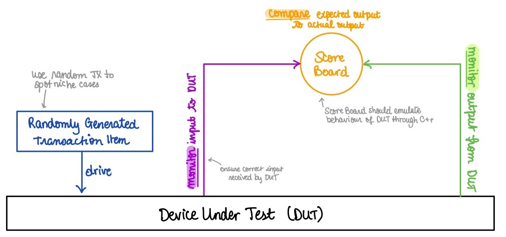

# TESTING STRATEGY

Testing and debugging, especially analysing waveforms, soon became a very cumbersome task. The group then resolved to using UVM self-testing testbenches to debug SystemVerilog programs.

The `Universal Verification Methodology`[^1] (UVM) is a well-known framework used for verifying the functionality of digital designs. 

A`transaction item`, usually a randomly generated set of inputs, is driven into the `Device Under Test` (DUT). The DUT's output is - in turn - monitored, and subsequently compared to a set of expected outcomes through a `ScoreBoard`. This configuration enables automated verification testing. Here, the transaction items act as stimuli, initiating tests on the DUT. Meanwhile, the ScoreBoard functions as a critical checkpoint. The diagram allows for a visualisation of the overall process:




UVM was opportunity to apply theoretical knowledge of object-oriented programming gained through last year's `Programming for Engineers` to a real-life tangible example.

Indeed, throughout our C++ program, six different classes had to be defined:
1. `DUT Input`: the transaction item
2. `Transaction Item Driver`: the component pushing transaction items into the DUT
4. `Input Monitor`: the component ensuring transaction item is received by DUT interface
3. `DUT Output`: the response to the transaction item
4. `Output Monitor`: the component reading output at DUT interface
5. `Scoreboard`: the checkpoint at the heart of our UVM program


Below are code samples taken from `Program Counter`'s UVM testbench. For conciseness, we opted to only include here the `PCTxIn`, `InMonitor` and `Scoreboard PcCsb`. The other three classes can easily be derived from them. For the whole testbench, click [here]().


<u> Transaction Item Class: </u> Define all input pins, and randomly generate values for them

```C++
class PcInTx
{
public:
    uint32_t imm_ext_i, jta_jalr_i;
    uint jump_taken_i, rst_i, jalr_instr_i;
};

```

These inputs are randomly generated through the function:

```C++
PcInTx *rndPcInTx()
{
    PcInTx *tx = new PcInTx();
    tx->imm_ext_i = 4 * (rand() % 25);
    tx->jump_taken_i = rand() % 2;
    tx->jta_jalr_i = 4 * (rand() % 25) + 0xBFC00000;
    tx->jalr_instr_i = 0;
    if (tx->jump_taken_i)
    {
        tx->jalr_instr_i = rand() % 2;
    }
    return tx;
}
```

	One must not forget to initilize the seed in main through `srand(time(NULL))`.


<u> Input Monitor Class: </u> Items are passed from DUT interface to reference Transaction Item `tx`

```C++
class PcInMon
{
public:
    PcInMon(Vpc *dut, PcScb *scb)
    {
        this->dut = dut;
        this->scb = scb;
    }

    void monitor()
    {
        // create a new transaction item and populate it with data observerd at the interface pin
        PcInTx *tx = new PcInTx();
        tx->imm_ext_i = dut->imm_ext_i; // repeat for all inputs
        
        
        // pass transaction item to score board
        scb->writeIn(tx);
    }

private:
    Vpc *dut;
    PcScb *scb;
};
```

> Output Monitor strongly resembles this class.


<u> Scoreboard: </u> Transaction items are saved in a queue. First introduced transaction item is compared to the current outputs

```C++
class PcScb
{
public:
    // input interface monitor port
    void writeIn(PcInTx *tx)
    {
        in_q.push_back(tx);
    }

    // output interface monitor port
    void writeOut(PcOutTx *tx)
    {

        // check queue
        if (in_q.empty())
        {
            std::cout << "Fatal Error in PcScb: Empty PcInTx queue" << std::endl;
            exit(1);
        }

        // grab transaction item from front of queue
        PcInTx *in;
        in = in_q.front();
        in_q.pop_front();

		// emulate behaviour of SystemVerilog file here

    }

private:
    std::deque<PcInTx *> in_q;
};
```


The `main` function is then modified to only pass on new `Transaction Items` on rising clock edges:

```C++
for (simcyc = 0; simcyc < MAX_SIM_CYC; simcyc++)
    {
        for (clk = 0; clk < 2; clk++)
        {
            tfp->dump(clk + 2 * simcyc);
            dut->clk_i = !dut->clk_i;
            if (dut->clk_i)
            {
                // generate a randomised transaction item
                tx = rndPcInTx();
                tx->rst_i = (simcyc % 10 == 0) ? 1 : 0;
                drv->drive(tx);
                // monitor the input interface
                inMon->monitor();
                // if on falling clock edge
            }
        }

        if ((Verilated::gotFinish()))
        {
            break;
        }
    }
```


UVM was used to test `PC`, `SignExtend`, `RegisterFile`, `ALU`, `DataMemory`, `InstructionMemory` and `MainDecoder`.

UVM did not entirely eliminate the necessity to analyse, it significantly reduced the time spent debugging by only flagging errors when the actual output deviated from expectations. An example below with the `MainDecoder` component:


This turned out to be a simple oversight in the `MainDecoder` SystemVerilog file:


We would have loved to implement a full-UVM testbench for the top CPU file, but lacked the time to do so.


[^1]: We heavily relied on online resources, especially N. Kremeris' [Verilator Guide](https://www.itsembedded.com/dhd/verilator_4/#appendix-a-other-termscomponents-you-may-encounter) to fully grasp the different implications of UVM.