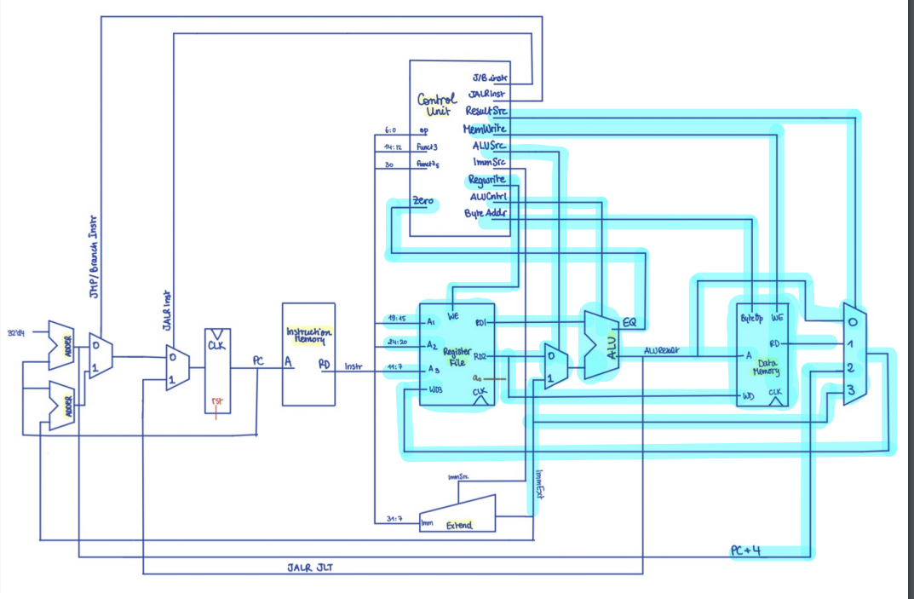

## Data_path

This module is the combination of the register_file, the alu and the data_memory. It has the following schemetic highlighted:

 *schemetic drawn by Sara, highlighted by Lu

A few multiplexers are added internally in this module. 

Input `result_src_i` determines which of the results computed will be the next input value to the register value. This is closely linked with the type of instructions ( see side comments below)

``` SystemVerilog
always_comb begin
    case (result_src_i)
        2'b00: reg_wd = alu_out_o;      // arithmetic instructions
        2'b01: reg_wd = data_mem_rd;    // load instructions
        2'b10: reg_wd = pc_next_i;      // jump instructions 
        2'b11: reg_wd = imm_ext_i;      // load immediate instructions
        default: reg_wd = {DATA_WIDTH{1'b0}}; 
    endcase
end
```

Another internal mutiplexer is used for one of the input at the alu:

``` SystemVerilog
.src2_i(alu_src_i ? imm_ext_i : reg_rd2),
``` 

In this scenario, control input `alu_src_i` selects whether the value from register file or the extended immediate value is input into the alu for arithemetic instructions.

