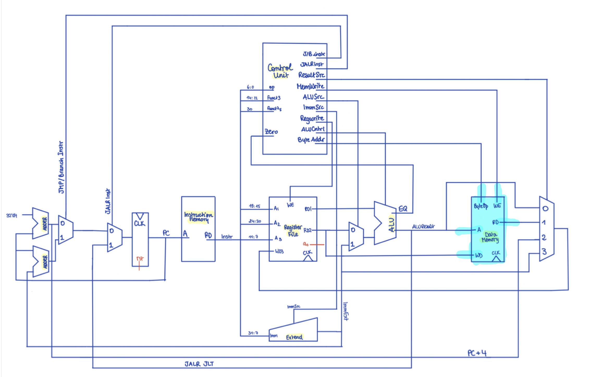
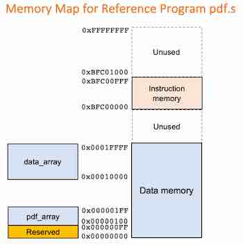

## Data_memory


The data memory stores information can be accessed and written by the CPU through `LOAD` and `STORE` instructions.


### Byte Addressing

When first designing this component, we opt for word-addressing. We quickly revert back to byte-addressing though, after realising that this would better suit RISC-V specifications since:
- it allows for precise addressing of individual bytes in memory
- it allows for more efficient manipulation of segments of data

Byte-addressing follows a little endian scheme.


### Overview

Data memory has inputs:
- `ByteOp`: determines whether the current instruction is a byte level read or write
- `WE`:  enables writing into the memory 
- `ADDR`: the destination byte address

Data memory schematics and where it positions in the overall cpu:

 *schemetic drawn by Sara, highlighted by Lu


### Writing and Reading

Initially, the decision made is that the memory gets written in the positive edge of the clock cycle.

When writing is enabled, if it is a load byte instruction, the input byte (the lower 8 bit value of the data input `WD`), is loaded into the destination address. 

If it is not a load byte instruction, instead the instruction is to load the whole 4 byte word at the word address region that contains the byte address, and it is useful to find the equivalent smallest address in the word storing. The `AND` logical operation in `ADDR & 32'hFFFFFFFC` masks the least two significant bits of `ADDR`, and thus gives the address to be the least significant starting byte address of the word. 

Overall, as the storing part of the memory is similarly as the following:

``` SystemVerilog
always_ff @(negedge clk_i) begin
    if (we_i)
        case (byte_op_i)
            1'b1: data_ram[addr] <= wd_i[BYTE_WIDTH-1:0];
            1'b0: begin
                data_ram[addr+0] <= wd_i[BYTE_WIDTH-1:0];
                data_ram[addr+1] <= wd_i[2*BYTE_WIDTH-1:BYTE_WIDTH];
                data_ram[addr+2] <= wd_i[3*BYTE_WIDTH-1:2*BYTE_WIDTH];
                data_ram[addr+3] <= wd_i[4*BYTE_WIDTH-1:3*BYTE_WIDTH];
            end
        endcase
    end
```

> Note that a case is used here instead of an if statement because it is clearer code wise. No default case is needed because all possible outcomes of the byte_op_i is taken into consideration


In the meantime, reading the value in the data memory does not depend on the clock, and always depend on the given input of `ADDR`, or equivalently, depend of final `ADDR` as a result of this multiplexer on the word or byte operation: 

``` SystemVerilog
logic addr = byte_op_i ? addr_i : (addr_i & 32'hFFFFFFFC);

assign rd_o = byte_op_i ? {{3*BYTE_WIDTH{1'b0}}, data_ram[addr]} : {data_ram[addr+3], data_ram[addr+2], data_ram[addr+1], data_ram[addr+0]};
```


Upon discussion with the team, the memory is instead then written on the negative edge of the clock instead. This becomes useful for the later on pipelining implementation of the CPU to avoid further data hazards. 

It is also needed to be mentioned that according to the specification as shown below:



The ending address of the data memory is 0x1FFFF, and it starts at address 0x0. To test the reference program that initialises the data_array from address 0x10000 to 0x1FFFF, it is also decided that the rest of the data memory stored value is initialised to 0. 


### Testing

Testing of this component is done through a UVM testbench.

The overall behaviour of our data memory is emulated in our C++ program through a vector we constantly update depending on the randomly generated transaction item.


