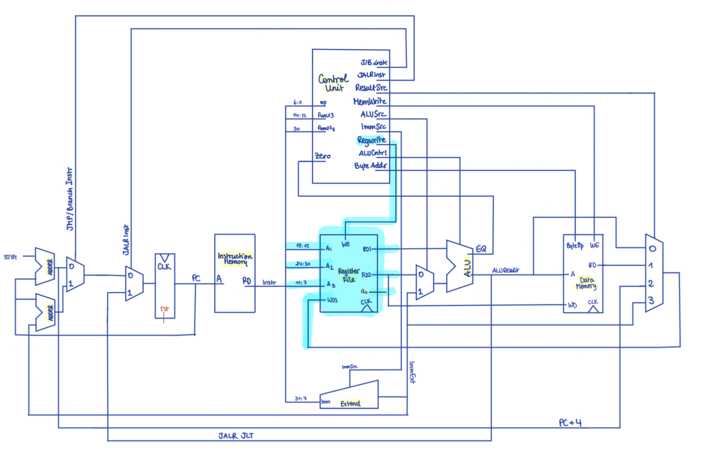

## Register_file

Register file schematics and where it positions in the overall cpu:

 *schemetic drawn by Sara, highlighted by Lu

<br>

The `registerfile` is a very straight forward module to write. 

As the same as the data_memory, initially the team chooses to write into the registers at the positive clock edge but later changes into the negative clock edge for easier implementation of the pipelining. There are 32 registers in total, controlled by 5 bit address and are implemented internally. 

The following variables:
- `TRIGGER`: written to register s3
- `AD1` and `AD2`: addresses of register to be read
- `AD3`: write address for register file at address input
- `WE`: write enable
- `WD`: value to be written into register file at address input `AD3`
- `RD1` and `RD2`: asynchronous read values of `AD1` and `AD2`
- `A0`: asynchronous read values of register `A0`

> Note that initially, all the register file's value are set to 0. Register file at address 0x0 is the zero register file, it holds value 0 at all time. So the if condition below makes sure that even nothing gets written into this zero register file even when write enabled:

``` SystemVerilog
if (addr3_we_i && addr3_i != 0) begin
	rf[addr3_i] <= addr3_wd_i;
end
```

## Testing

Our `RegisterFile` is tested through a `UVM` testbench. 
The register values are tracked in C++ using a vector:

```C++
std::vector<uint> simulated_register_file(32);

// in Scoreboard, emulating behaviour of component
if (in->addr3_we_i && in->addr3_i != 0){
    simulated_register_file[in->addr3_i] = in->addr3_wd_i;
}
```

Picture below of a UVM simulation:

