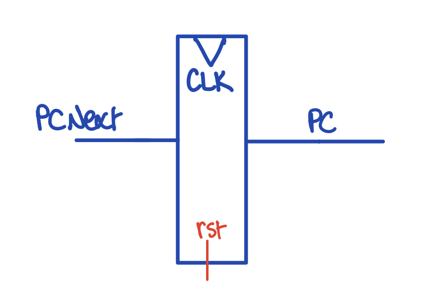
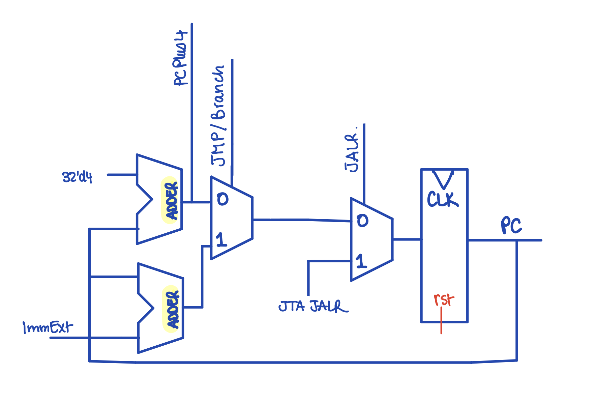
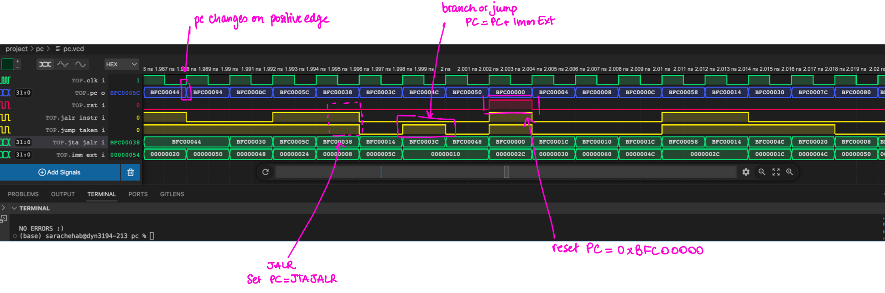

# Program Counter

A CPU's Program Counter (PC) constitutes the backbone of program execution. Indeed, Program Counters maintain the memory address of the current instruction `PC` and point to the next instruction `PCNext`.



RISC-V instructions are 4-bytes long. PC should then be incremented by 4 when no jump is taken to account for the instruction memory's byte addressing.  Here, `PCNext = PC + 4`.

Introducing `Branch` and `JAL` instructions also introduce a first multiplexer within our `PC` component. This multiplexer would then have to choose from:
-  `PCPlus4 = PC + 4` if `JB_Taken` is `LOW`
- `PCTarget = PC + ImmExt` if `JB_Taken` is `HIGH`

The multiplexer's Select Input `JB_Taken` originates from the `ControlUnit`, and is only dependant on the `ALU` in the case of `Branch` instructions.


`JALR` instructions - in turn - require additional hardware. A new output had to be asserted from the `ControlUnit` to drive yet another multiplexer:
- `PCNext = PC'` if `JALRinstr` is `LOW`
- `PCNext = JTA_JALR` if `JALRinstr` is `HIGH`

`JTA_JALR` is computed within the `ALU` since `PC := rs1 + ImmExt`, as per RISC-V brief.

A `reset` pin was also necessary to restart the `F1` program by bringing pointing `PCNext` to the very first instruction when `Vbuddy's Flag` is toggled.

Our `ProgramCounter.sv` component  finally needed an additional output, `PCPlus4`, to complete the implementation of subroutines with both `JAL` and `JALR` instructions. Register `ra` would then be written to contain the subroutine's return address: `ra := PCPlus4`.

All of these modifications give rise to the following schematic:




The above cascading multiplexer interface can be transposed into a SystemVerilog program:

```SystemVerilog
always_ff @ (posedge clk) begin
        if (rst)  pc_next <= 32'hBFC00000;
        else begin
            case (jalr_instr_i)
                1'b0: pc_next <= jump_taken_i ?  (pc_next + imm_ext_i) : (pc_next + 32'd4);
                1'b1: pc_next <= jta_jalr_i;
            endcase
            
        end
        
    end 
```


An additional block had to be added to account for the Memory Map provided in the Project Brief, as the instruction memory only begins at address `0xBFC00000`:

```SystemVerilog
    initial begin 
        pc_next = 32'hBFC00000;
    end
```


This Program Counter had to be adjusted for pipelining:
1. Introducing stalls to the `ProgramCounter` register through an active-low enable `EN` to mitigate Data Hazards and bubbles introduced by `LOAD` instructions
2. Inputting `PCTarget` into `ProgramCounter` from the `EXECUTE` stage in which a decision on branching is issued


> It is only in the `EXECUTE` stage that a decision in regards of branching and/or jumping is made. The Program Counter thus introduces a Control Hazard due to its "Jump is not Taken" assumption. This assumption was however necessary to limit the number of stalls we would need to implement our programs. A clear `CLR` functionality had to be added to the `DECODE` and `EXECUTE`pipeline registers to mitigate that slip.


``` SystemVerilog
    always_ff @ (posedge clk) begin
        if (rst)  pc_next <= 32'hBFC00000;
        else begin
            if (en_i)
                case (jalr_e_i)
                    1'b0: pc_next <= jb_taken_e_i ?  (pc_target_e_i) : (pc_next + 32'd4);
                    1'b1: pc_next <= jta_jalr_e_i;
                endcase
        end
        
    end 
```


PC was  tested through a UVM testbench generating random transaction items, with arbitrary values for `JALRinstr`, `JBTaken` and `ImmExt`.

